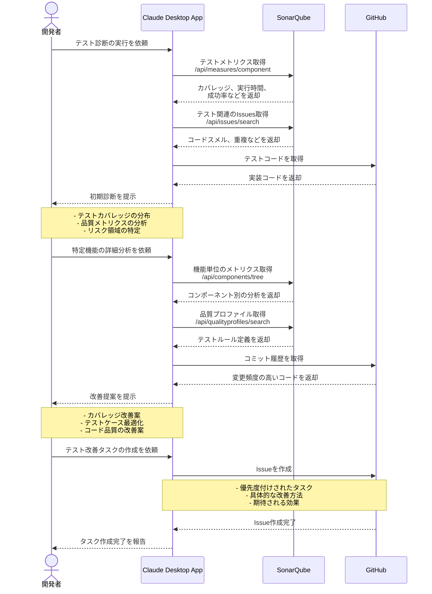

# テスト自動化の診断をする

## アイデア
SonarQubeとGitHubの情報を組み合わせ、テスト品質を総合的に分析する。カバレッジやテスト実行時間などの定量的な指標と、テストコードの質的な分析を組み合わせて、具体的な改善提案を行う。

### 具体例
大規模なWebアプリケーション開発で、ユニットテスト（Jest）、E2Eテスト（Playwright）、統合テスト（Cypress）が混在する環境において、テストスイート全体の品質と効率を改善したい場面

## アーキテクチャ
| Type | Name | Role |
|--|--|--|
| Client | Claude Desktop App | テスト分析と改善提案のアシスタント |
| Server | SonarQube | テストメトリクスとコード品質分析（要自作MCP Server） |
| Server | GitHub | テストコードとプロジェクト管理 |

## 思考プロセス

### 対象の活動の価値は何か
- データに基づく品質分析
    - カバレッジと実行時間の定量評価
    - コードスメルとテストの重複検出
    - 時系列での品質推移分析
- プロジェクト特性の理解
    - コンポーネント構造の把握
    - 品質基準とルールセットの活用
    - 変更頻度と重要度の考慮
- 実践的な改善提案
    - リスク領域の優先度付け
    - 具体的なリファクタリング案
    - 自動化可能な改善タスク

### 価値を妨げる課題は何か
- メトリクスと実際の品質の乖離
- テストスイートの肥大化と複雑性
- チーム間での品質基準の統一
- 改善タスクの優先順位付け

### なぜ課題が発生するのか、仮説推論
- テストの多面的な性質
    - カバレッジだけでは不十分
    - 実行速度とメンテナンス性のトレードオフ
    - テストケースの意図や文脈の重要性
- プロジェクトの成長による課題
    - コンポーネントの依存関係
    - テスト環境の複雑化
    - 品質基準の変化
- チーム運用での難しさ
    - 品質指標の解釈の違い
    - 改善コストの見積もり
    - リソース配分の最適化