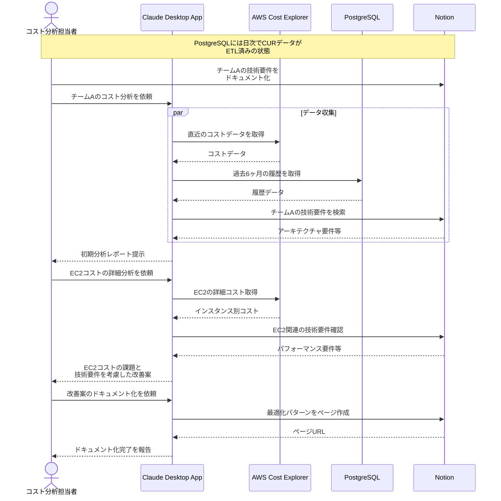

# クラウドコストの分析を自動化する

## アイデア
クラウドコストの分析において、データウェアハウスに蓄積された履歴データとNotionに記録された技術的な文脈を組み合わせて、実行可能な最適化施策を提案する。

### 具体例
複数の開発チームが独立してクラウドサービスを利用している組織で、コスト分析担当者がチーム間の比較分析を行い、各チームの技術的な制約を考慮した実現可能な改善案を提示する必要がある場面

## アーキテクチャ
| Type | Name | Role |
|--|--|--|
| Client | Claude Desktop App | コスト分析の対話型アシスタント |
| Server | AWS | Cost Explorer API経由でのコストデータ取得 |
| Server | PostgreSQL | 履歴コストデータの分析基盤 |
| Server | Notion | 技術要件とコスト最適化の知見管理 |

## 思考プロセス

### 対象の活動の価値は何か
- チーム間でのクラウドコスト効率の可視化
- 技術的な制約を考慮した実現可能な改善案の提示
- コスト最適化のナレッジの蓄積と共有
- データに基づく意思決定の促進

### 価値を妨げる課題は何か
- コストデータと技術要件の関連付けの複雑さ
- チーム固有の制約の理解と考慮の難しさ
- 改善案の実現可能性の評価
- 最適化ナレッジの形式知化

### なぜ課題が発生するのか、仮説推論
- 技術要件とコストの因果関係が不明確
- チーム間での技術スタックの違い
- コスト効率と技術要件のトレードオフ
- ナレッジ共有の仕組みの不足