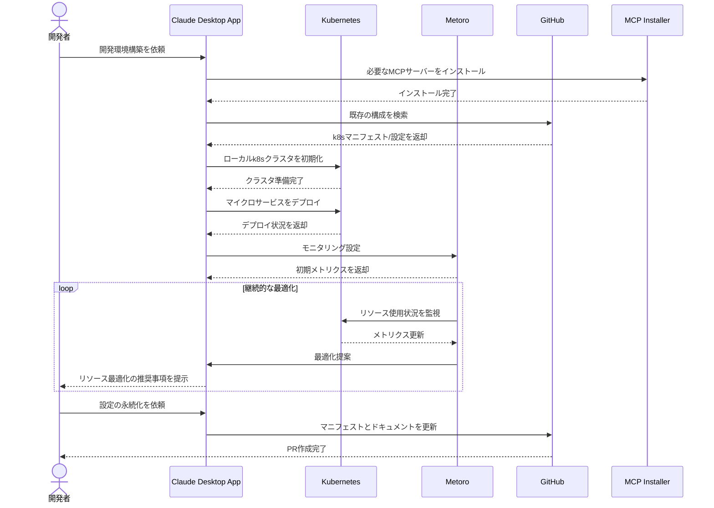

# チーム全体の開発環境を最適化する

## アイデア
Kubernetesを中心とした開発環境の構築・最適化を、チーム全体の開発フローと連携させながら自動化する。GitHubのIssuesでの技術的な議論と既存のナレッジベースを組み合わせることで、実践的なKubernetes環境を構築する。

### 具体例
マイクロサービス開発チームで、各サービスがKubernetesマニフェストを持ち、それらを連携させながら開発環境を最適化する必要がある場面。特に、新規メンバーの参画時や技術スタックのアップデート時に、環境構築の効率化が求められる。

## アーキテクチャ
| Type | Name | Role |
|--|--|--|
| Client | Claude Desktop App | 開発環境構築の対話型アシスタント |
| Server | Kubernetes | コンテナオーケストレーションと環境管理 |
| Server | Metoro | Kubernetes環境のモニタリング |
| Server | GitHub | 環境構築のナレッジベースと技術的な議論 |
| Server | MCP Installer | 必要なMCPサーバーの自動インストール |

## 思考プロセス

### 対象の活動の価値は何か
- Dev ContainersやCursorとの違いは、以下の点で価値を創出:
    - チーム全体でのKubernetes環境の一貫性担保
    - ローカルk8s環境の構築と検証の自動化
    - リソース使用状況の可視化と最適化提案
    - ナレッジベースと実践的な議論を組み合わせた環境設定
    - 本番環境に近い形での開発環境の提供

### 価値を妨げる課題は何か
- マイクロサービス間の依存関係の複雑さ
- チームメンバー間での環境差異
- k8sリソース使用の最適化
- 頻繁な環境更新への対応
- ローカル開発環境のリソース制約

### なぜ課題が発生するのか、仮説推論
- マイクロサービス構成によるk8s環境の複雑化
- メンバーごとの開発マシンスペックの違い
- Kubernetesの学習曲線の急峻さ
- ローカル環境と本番環境の差異
- 標準的なベストプラクティスと最新の技術動向の統合の難しさ

### 解決のアプローチ
1. **環境構築の自動化**
   - MCPインストーラーによる必要なツールの自動セットアップ
   - k8sマニフェストの自動生成と適用
   - GitHubとの連携による設定の永続化

2. **リソース最適化**
   - Metoroによる継続的なモニタリング
   - リソース使用状況に基づく最適化提案
   - チーム全体での一貫した環境設定

3. **ナレッジ管理の強化**
   - 最適化された設定のGitHubへの自動コミット
   - チーム全体で利用可能な設定テンプレートの作成
   - トラブルシューティングナレッジの蓄積