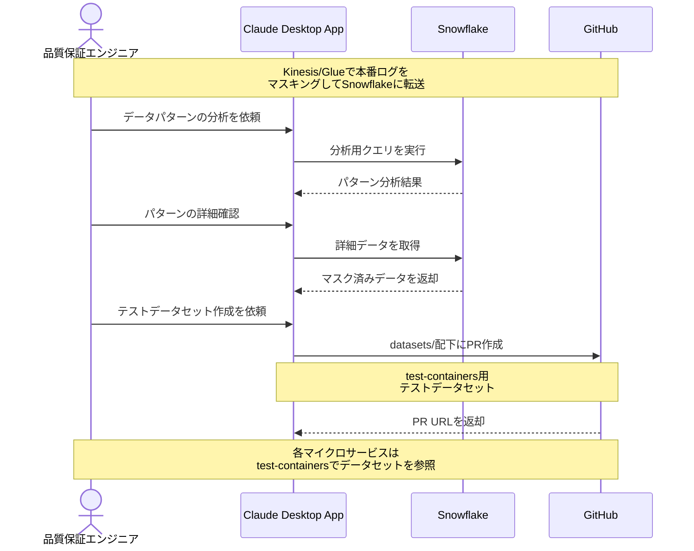

# 本番データからテストを自動生成する

## アイデア
検証したい期間の本番トラフィックログとデータを安全にマスキングした上で、実際のユースケースに基づくE2Eテストとシステムテストのシナリオおよびテストケースを自動生成する。実データに基づく現実的なテストにより、従来見落としていたエッジケースの発見や、本番で実際によく使われるフローの優先的なテスト実施を可能にする。

### 具体例
マイクロサービス環境での決済システムにおいて、新機能リリース後2週間のトラフィックから、様々な決済パターンや特殊なエッジケースを収集。個人情報を適切にマスキングした上でtest-containersで再現可能なテストデータセットとして整理し、システム全体の品質を向上させる場面

## アーキテクチャ
| Type | Name | Role |
|--|--|--|
| Client | Claude Desktop App | テスト生成の対話型アシスタント |
| Server | Snowflake | 大規模な本番ログの分析基盤 |
| Server | GitHub | テストデータセット・テストケースの管理 |

## 思考プロセス

### 対象の活動の価値は何か
- 本番環境の実データに基づくテスト品質の向上
    - 実際のユースケースの網羅
    - エッジケースの発見
    - データの現実性担保
- テストデータセットの再利用性向上
    - 有用なパターンの一元管理
    - test-containersによる環境の統一
    - データ準備工数の削減
- プライバシーとセキュリティの確保
    - 確実なデータマスキング
    - 機密情報の除去
    - コンプライアンス対応

### 価値を妨げる課題は何か
- データ収集とマスキングの複雑さ
    - 個人情報の特定
    - 機密データの判別
    - 整合性の維持
- 大規模データの効率的な分析
    - パターンの抽出
    - エッジケースの特定
    - 処理性能の確保
- test-containers用データセットの制約
    - 現実的なデータ量の設定
    - 依存関係の考慮
    - 環境リソースの制約

### なぜ課題が発生するのか、仮説推論
- システムの複雑性
    - マイクロサービス間の依存
    - 非同期処理の存在
    - 外部サービス連携
- データの特性
    - 大規模なログデータ
    - 時系列での変化
    - ビジネスルールの影響
- 運用上の制約
    - プライバシー規制
    - パフォーマンス要件
    - リソースコスト