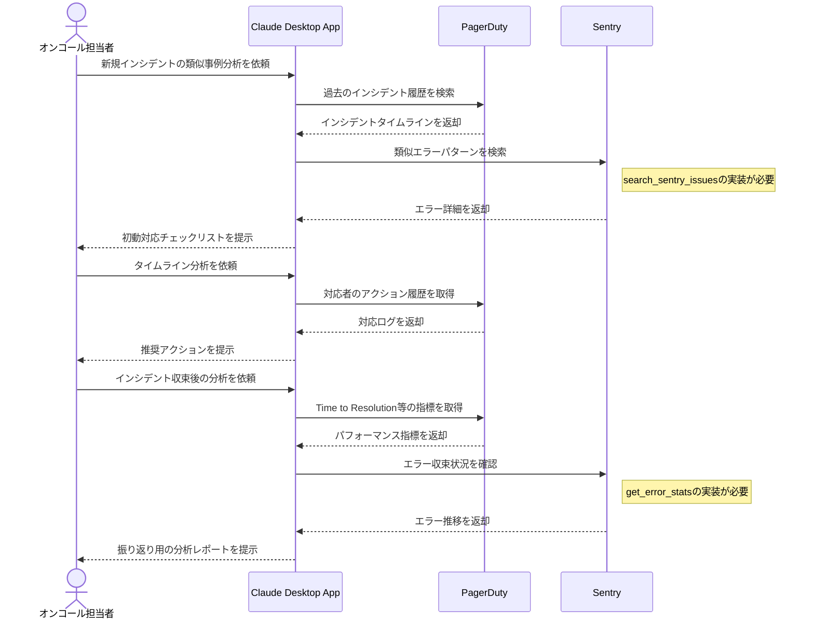

# 障害対応履歴の活用を最適化する

## アイデア
PagerDutyのタイムラインデータとSentryのエラー詳細を統合的に分析し、インシデント対応ナレッジを体系化する。過去の対応パターンを学習し、類似インシデントの初動対応を効率化する。

### 具体例
マイクロサービス環境で深夜にクリティカルなインシデントが発生した際に、過去の類似インシデントの対応履歴から、初動対応のチェックリストと解決の手がかりを即座に提供する場面

## アーキテクチャ
| Type | Name | Role | Status |
|--|--|--|--|
| Client | Claude Desktop App | インシデント分析の対話型アシスタント | - |
| Server | PagerDuty | インシデントタイムラインと対応記録の取得 | 要実装 |
| Server | Sentry | エラー詳細とコンテキストの取得 | 要拡張※1 |

※1 Sentry Serverの必要な拡張：

- `search_sentry_issues`: エラーメッセージや条件による類似イシューの検索（/api/0/projects/{org-slug}/{project-slug}/issues/）
- `get_error_stats`: 時系列でのエラー発生推移の取得（/api/0/organizations/{org-slug}/stats/）

## 思考プロセス

### 対象の活動の価値は何か
- インシデント対応時間（MTTR）の短縮
- オンコール担当者の精神的負担の軽減
- 組織的な障害対応ナレッジの蓄積
- データに基づく対応プロセスの改善

### 価値を妨げる課題は何か
- インシデント情報の正確な関連付け
- インフラ構成の変更に応じた類似性判定
- 深夜帯での迅速な判断支援
- 時系列でのパターン分析

### なぜ課題が発生するのか、仮説推論
- インシデント情報の複数ソース
    - PagerDuty：タイムラインと対応記録
    - Sentry：技術的なエラー詳細
- 時間経過による状況変化
    - インフラ構成の更新
    - 対応手順の陳腐化
    - チーム編成の変更
- 深夜対応での認知負荷
    - 情報収集の困難さ
    - 判断の不確実性
    - 確実な対応への不安