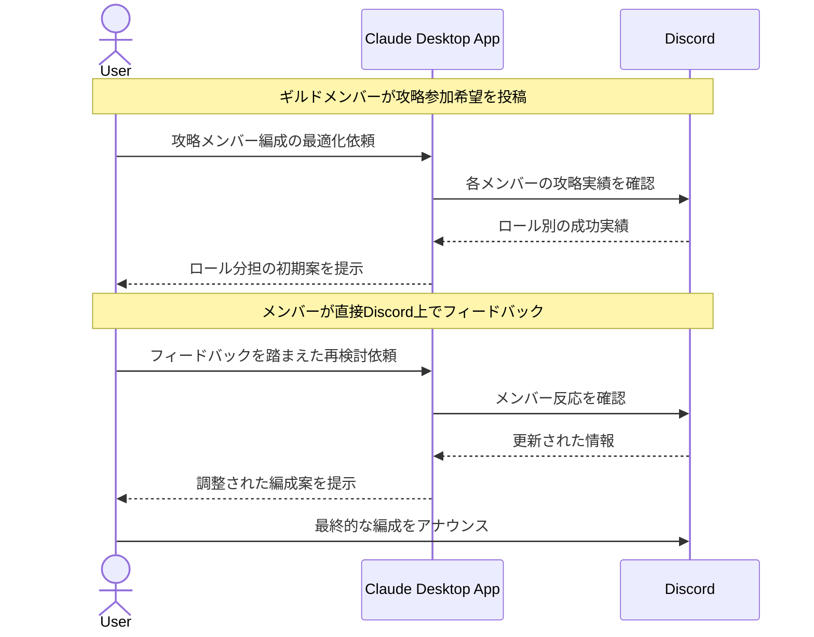

# ゲーム攻略の予定を楽しく共有する

## アイデア
Discord APIを活用し、ゲーム攻略メンバーの予定調整とロール分担を効率化。チャット履歴から各メンバーの得意ロールを分析し、楽しく円滑な攻略を支援する 

### 具体例
大規模オンラインゲームで、30人規模のレイドコンテンツに挑むギルドが、メンバーの活動パターンとスキル実績から最適な編成を導き出す 

## アーキテクチャ

| Type | Name | Role |
|--|--|--|
| Client | Claude Desktop App | パーティ編成の最適化判断を行う |
| Server | Discord (Custom) | Discord APIを利用したアクティビティ記録の自作Server |

## 思考プロセス

### 対象の活動の価値は何か
- チームワークの達成感 
    - オンラインゲームのハイエンドコンテンツは、多人数での緻密な連携が必要。全員で目標を達成する喜びは、現代人が失いがちな「共同体験」の機会となる 
- コミュニティの維持・発展 
    - 定期的な共同活動は、オンラインコミュニティの結束を強める。匿名の関係でありながら、信頼関係や帰属意識が育まれる 

### 価値を妨げる課題は何か
- コミュニケーションの分断 
    - ゲーム内チャット、外部ボイスチャット、SNSなど、情報のやり取りが複数のプラットフォームに散在 
- ロジスティクスの複雑さ 
    - 多人数の予定調整、役割分担、準備状況の確認など、管理すべき要素が多岐にわたる 

### なぜ課題が発生するのか、仮説推論
- 重要な情報が埋もれたり、メンバー間で認識の齟齬が生じやすい 
- 特に、急な欠席や遅刻への対応が難しく、全体の予定に影響を及ぼす 
