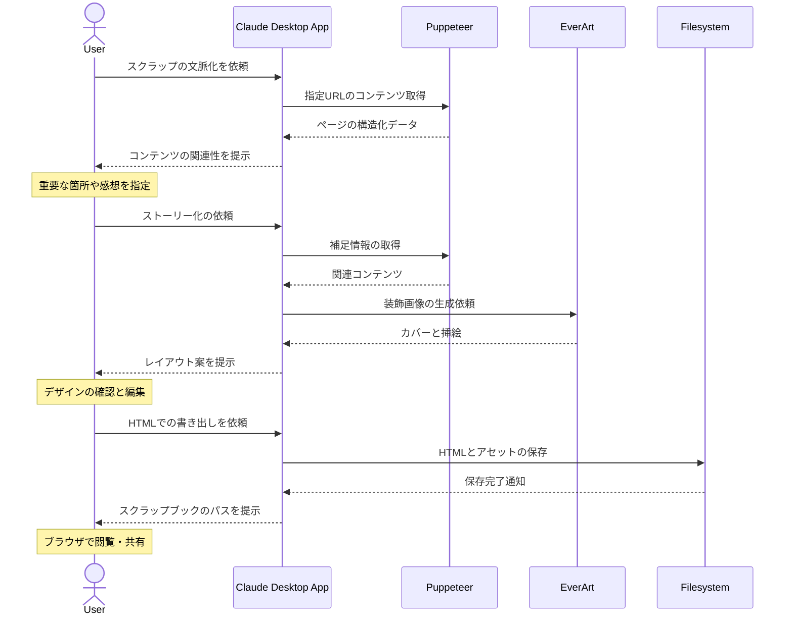

# スクラップをストーリーに変換する

## アイデア
PuppeteerでWebコンテンツを取得し、その情報の背景や文脈を保持しながら、EverArtで装飾されたHTMLスクラップブックとして再構築する。オフラインでも閲覧可能な思い出集として保存する 

### 具体例
音楽フェスに関する記事や写真、SNS投稿を収集し、時系列やアーティストごとにストーリー化。装飾された見出しや挿絵を加えながら、情報同士の関連性や当時の感動を保ったまま記録として残す 

## アーキテクチャ

| Type | Name | Role |
|--|--|--|
| Client | Claude Desktop App | 情報の文脈化と構造化を行う |
| Server | Puppeteer | Web上の画像、テキスト、メタ情報の取得 |
| Server | EverArt | スクラップブックの装飾画像生成 |
| Server | Filesystem | HTMLと画像アセットの永続化 |

## 思考プロセス

### 対象の活動の価値は何か
- 体験の文脈化 
    - バラバラの情報を文脈に沿って整理することで、単なる情報の集積以上の意味を見出せる。時系列や関連性が明確になり、より深い理解や感動が生まれる 
- 創造的な再構成 
    - 複数のソースから得た情報を自分なりに再構成することで、新しい視点や気づきが生まれる。また、他者と共有することで、体験の価値がさらに高まる 

### 価値を妨げる課題は何か
- 情報収集の非効率 
    - Web上の情報は日々更新され、また消えていく。必要な情報を見つけ出し、適切なタイミングで保存する作業が煩雑 
- コンテキストの維持 
    - 単にファイルを保存するだけでは、その情報の背景や重要性が時間とともに薄れていく 

### なぜ課題が発生するのか、仮説推論
- 情報の寿命が短く、後から見返したときに当時の状況や感動が思い出せない 
- なぜその情報を保存したのか、という文脈が失われやすく、単なるファイルの集積になってしまう 
