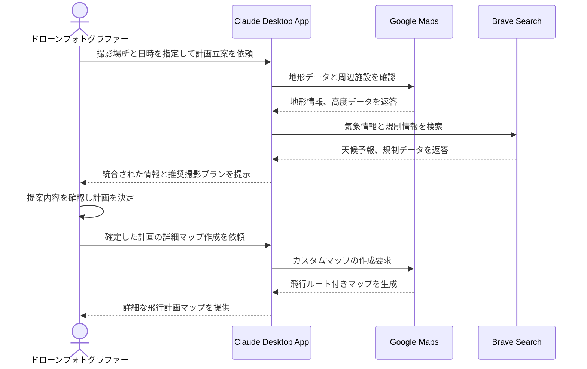

# ドローン空撮の計画を最適化する

## アイデア
Google MapsとBrave Searchを組み合わせ、ドローン空撮の計画作成を支援。飛行制限区域の確認から天候予測まで、安全で効果的な撮影計画を提供する。

### 具体例
山岳地帯での紅葉空撮を計画する趣味のドローンフォトグラファーが、地形データと気象情報、規制情報を統合的に確認しながら、最適な撮影計画を立案する。

## アーキテクチャ
| Type | Name | Role |
|--|--|--|
| Client | Claude Desktop App | ユーザーの意図を理解し、適切な情報収集と計画策定を支援 |
| Server | Google Maps | 地形データ、高度情報、周辺施設の確認 |
| Server | Brave Search | 気象情報、規制情報、ドローン関連ニュースの収集 |

## 思考プロセス

### 対象の活動の価値は何か
- 安全で印象的な空撮映像の実現：通常見ることのできない視点からの映像で新しい感動体験を提供
- 自然との調和した撮影体験：山岳地帯での撮影による技術と自然の融合
- コミュニティでの経験共有：独自の撮影スポットやテクニックの共有

### 価値を妨げる課題は何か
- 複雑な法規制への対応の困難さ
- 天候による計画変更のリスク
- 最適な撮影ポイントの発見と共有の難しさ

### なぜ課題が発生するのか、仮説推論
- 地域や高度によって異なる規制、申請手続きの煩雑さが初心者の参入を妨げている
- 山岳地域特有の急な天候変化により、事前準備の有効性が低下する
- 個人の経験に依存する情報が多く、体系的な知識の蓄積が進みにくい