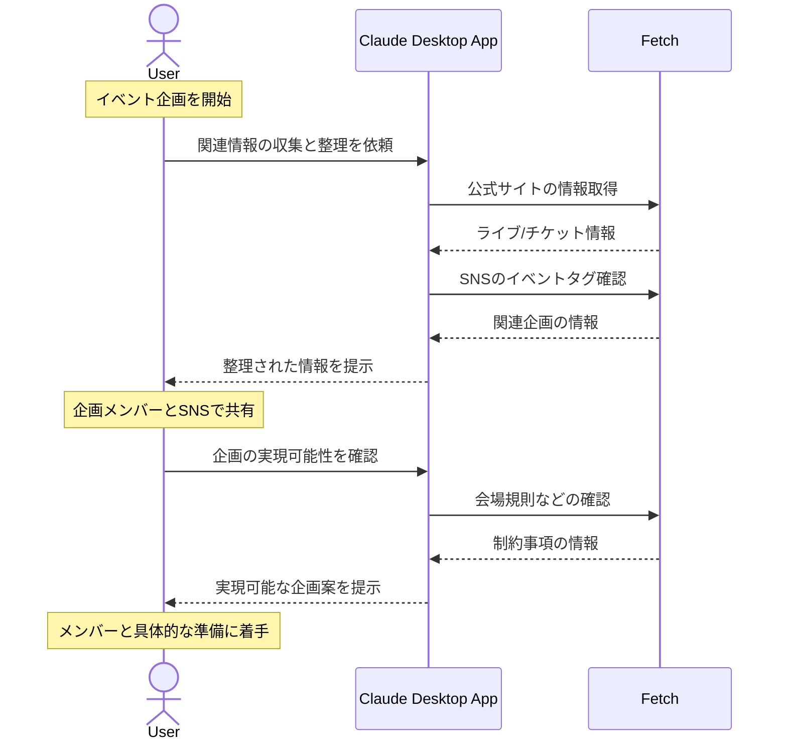

# ファン活動の情報をスマートに整理する

## アイデア
Fetchを用いて公式サイトやSNSの情報を適切に収集し、ファンクラブ活動に必要な情報を一元管理。共同企画の円滑な運営をサポートする 

### 具体例
アイドルグループのライブ当日に生誕祭を企画するファンが、チケット情報やイベント準備の進行状況を効率的に管理し、参加者と共有する 

## アーキテクチャ

| Type | Name | Role |
|--|--|--|
| Client | Claude Desktop App | 収集した情報の整理と企画提案を行う |
| Server | Fetch | 公式サイト、SNSからの情報取得と定期的な更新確認 |

## 思考プロセス

### 対象の活動の価値は何か
- ファン同士の絆の形成 
    - 推しを応援する気持ちを共有し、共同で企画を実現することで、オンラインとオフラインを跨いだコミュニティが形成される 
- 思い出作りの充実化 
    - 単なる観覧に留まらず、ファン同士で企画を実現することで、その過程自体が貴重な思い出となり、推しとの絆も深まる 

### 価値を妨げる課題は何か
- 情報収集の煩雑さ 
    - 公式サイト、ファンクラブサイト、SNS、チケット販売サイトなど、必要な情報が複数のプラットフォームに分散している 
- 協力者とのコミュニケーション調整 
    - オンラインで初対面の人々と協力する際、意図の齟齬や準備の進捗確認が難しい 

### なぜ課題が発生するのか、仮説推論
- 重要な告知を見逃すリスクがある。情報源が多岐にわたり、更新タイミングも不規則なため 
- 特に金銭の取り扱いは慎重な配慮が必要で、信頼関係の構築に時間がかかる 
