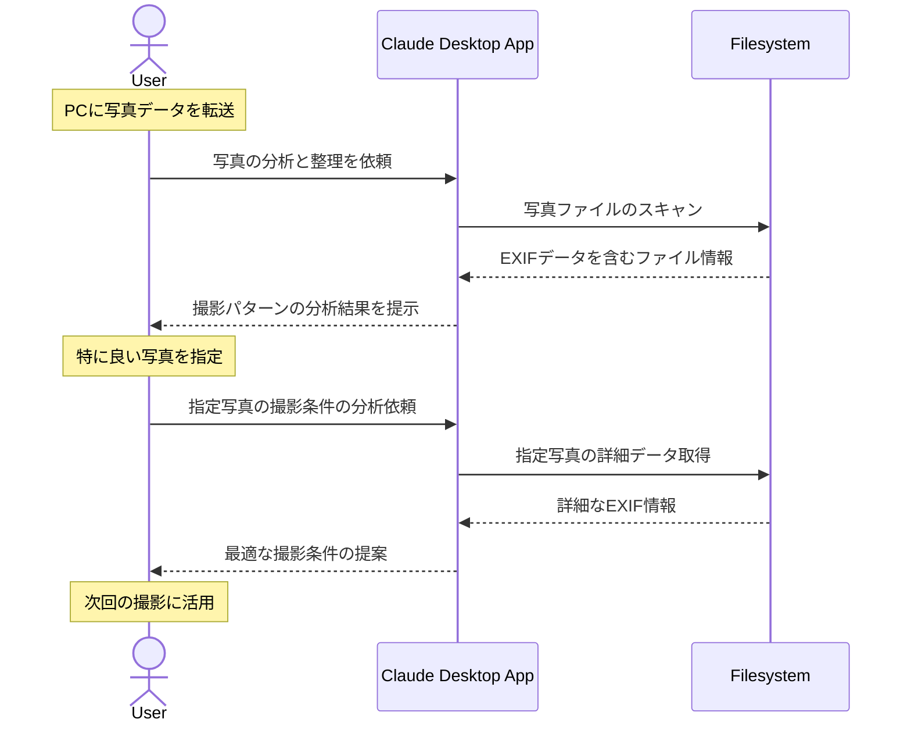

# 写真の整理を学びに変換する

## アイデア
Filesystemを用いて写真のEXIFデータを解析し、撮影条件と写真の出来栄えを関連付けて整理。写真整理を撮影技術の向上につなげる 

### 具体例
休日の撮影で大量に撮影した風景写真について、カメラ設定や撮影条件ごとに分類・分析し、より良い撮影のためのインサイトを得る 

## アーキテクチャ

| Type | Name | Role |
|--|--|--|
| Client | Claude Desktop App | 写真の分析と撮影技術の提案を行う |
| Server | Filesystem | EXIFデータを含む写真ファイルの読み取りと整理 |

## 思考プロセス

### 対象の活動の価値は何か
- 撮影技術の向上 
    - 過去の撮影設定と結果を振り返ることで、より良い設定や撮影方法を学習できる。特に風景写真は条件が似た場所で再挑戦することも多い 
- 思い出の整理と活用 
    - 写真は単なる記録以上の価値がある。適切に整理されることで、SNSでの共有や、後日の振り返りが容易になり、写真の価値が最大化される 

### 価値を妨げる課題は何か
- メタ情報の活用の難しさ 
    - シャッタースピードやF値などの技術的な情報は、一枚一枚確認するのに手間がかかる 
- 文脈に基づく分類の煩雑さ 
    - 写真の内容やシチュエーションによる分類は、手作業では時間がかかる 

### なぜ課題が発生するのか、仮説推論
- 似たような条件での撮影結果を比較検討しにくく、技術的な改善点を見出しづらい 
- 特に枚数が多いと、一貫性のある分類が難しくなり、写真の活用機会を逃す 
