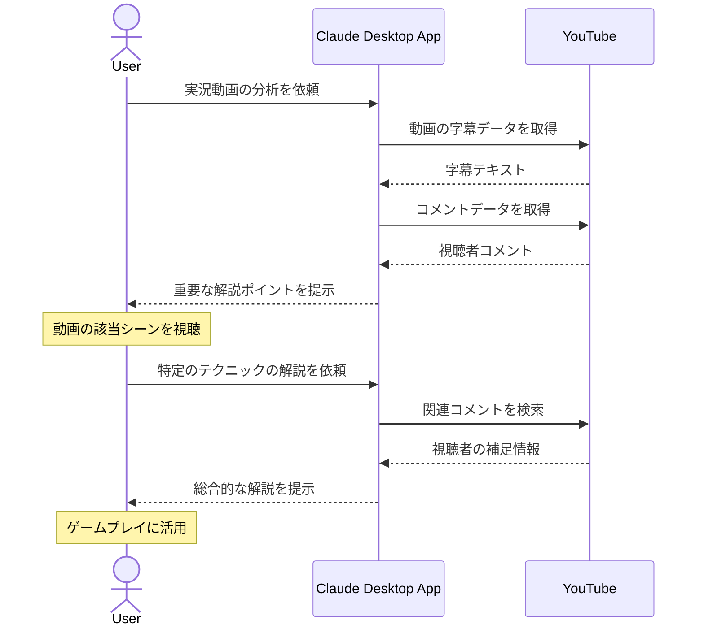

# 動画の重要ポイントを把握する

## アイデア
YouTube Data APIを用いて実況動画の字幕とコメントを分析し、実況者の解説や視聴者の情報共有をスマートに整理する 

### 具体例
アクションゲームの実況動画を視聴しながら、実況者の技術解説やコツの説明を的確に抽出し、自分のゲームプレイに活かす 

## アーキテクチャ

| Type | Name | Role |
|--|--|--|
| Client | Claude Desktop App | 動画コンテンツの分析と情報整理を行う |
| Server | YouTube (Custom) | 動画の字幕データとコメントの取得（YouTube Data API利用） |

## 思考プロセス

### 対象の活動の価値は何か
- 効果的な学習機会 
    - 実況者の解説や実演を見ることで、単なるゲームガイドよりも直感的に技術を習得できる。視聴者コメントから多様な攻略アプローチも学べる 
- コミュニティ体験 
    - 同じゲームに挑戦する視聴者との交流で、一人プレイでも孤独を感じにくい。共に上達を目指す仲間との繋がりが生まれる 

### 価値を妨げる課題は何か
- 情報の断片化 
    - 実況中の重要な説明や技術解説が長時間の動画の中に散らばっている 
- コミュニケーションの非効率 
    - コメント欄は時系列で流れていくため、有用な情報が埋もれやすい 

### なぜ課題が発生するのか、仮説推論
- 必要な情報を見つけ直すのに時間がかかり、学習効率が落ちる 
- タイミングや文字数の制限で十分な情報交換ができず、コミュニティの知見が活かしきれない 