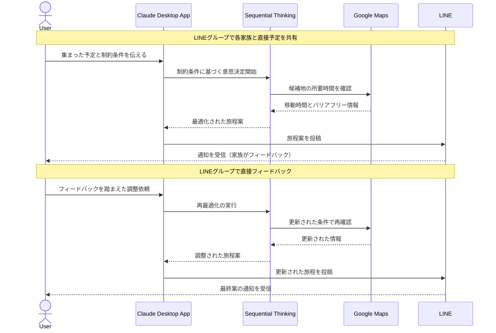

# 家族旅行の予定調整を最適化する

## アイデア
複数家族での旅行計画において、Google Mapsと統合したSequential Thinkingによる最適な旅程作成と、LINEを通じた円滑なコミュニケーションを実現する 

### 具体例
3世代の大人数での海外旅行を計画する際に、高齢者の体力や各家族の予定を考慮しながら、効率的な旅程作成と情報共有を行う 

## アーキテクチャ

| Type | Name | Role |
|--|--|--|
| Client | Claude Desktop App | 旅程最適化の中心的な判断を行う |
| Server | Sequential Thinking | 複数の制約条件を考慮した段階的な意思決定を行う |
| Server | Google Maps | 移動時間や経路、バリアフリー情報の取得 |
| Server | LINE (Custom) | メッセージ配信用の自作Server（Messenger API利用） |

## 思考プロセス

### 対象の活動の価値は何か

3世代で思い出を共有できる

- 推論：別々に暮らす家族が、貴重な共通体験を通じて絆を深められる。祖父母の人生経験や知恵を孫世代に伝える機会にもなる。 

全員が楽しめる最適な旅行になる

- 推論：各世代の希望やペースを考慮した計画により、誰かが我慢するのではなく、全員が主役として楽しめる。 

### 価値を妨げる課題は何か

1. 情報の統合と共有が複雑 

2. リアルタイムな調整が困難 

### なぜ課題が発生するのか、仮説推論

- 複数の家族の予定、好み、制約条件を一元管理し、全員が常に最新情報を把握するのが難しい。メッセージアプリやメールが混在し、重要な情報が埋もれやすい
- 予約状況や天候変更に応じて計画を修正する際、各家族との素早い合意形成が必要。時差があると即座の返信が得られず、予約の機会を逃すこと