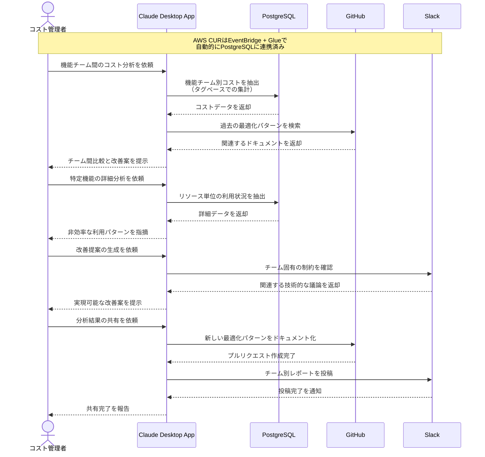

# クラウドコストの分析を自動化する

## アイデア
マイクロサービス単位で収集されたAWSコストデータを、機能チーム間で比較分析する。Cost and Usage ReportをData Warehouseに自動連携しつつ、チーム間の相対的なコスト効率を分析し、最適化のポイントを示唆する。

### 具体例
複数の機能チームが独立してマイクロサービスを運用している組織で、各チームのインフラコストを比較分析し、効率的なリソース利用パターンを発見・共有する必要がある場面

## アーキテクチャ
| Type | Name | Role |
|--|--|--|
| Client | Claude Desktop App | コスト分析の対話型アシスタント |
| Server | PostgreSQL | AWSコストデータの分析基盤 |
| Server | GitHub | 最適化パターンのドキュメント管理 |
| Server | Slack | コスト最適化の議論と共有 |

## 思考プロセス

### 対象の活動の価値は何か
- 機能チーム間での相対的なコスト効率の可視化
- リソース利用パターンの比較による具体的な改善点の特定
- チーム固有の制約を考慮した実現可能な最適化提案
- 最適化パターンの組織的な共有と活用

### 価値を妨げる課題は何か
- コストデータと機能チームの紐付けの複雑さ
- チーム間の技術スタックやワークロードの違い
- 最適化とサービス品質のバランス
- チーム固有の要件や制約の考慮

### なぜ課題が発生するのか、仮説推論
- タグ付けルールの統一が困難
- 機能要件によるインフラ構成の違い
- チーム間でのベストプラクティス共有の不足
- コスト最適化の優先度がチームにより異なる