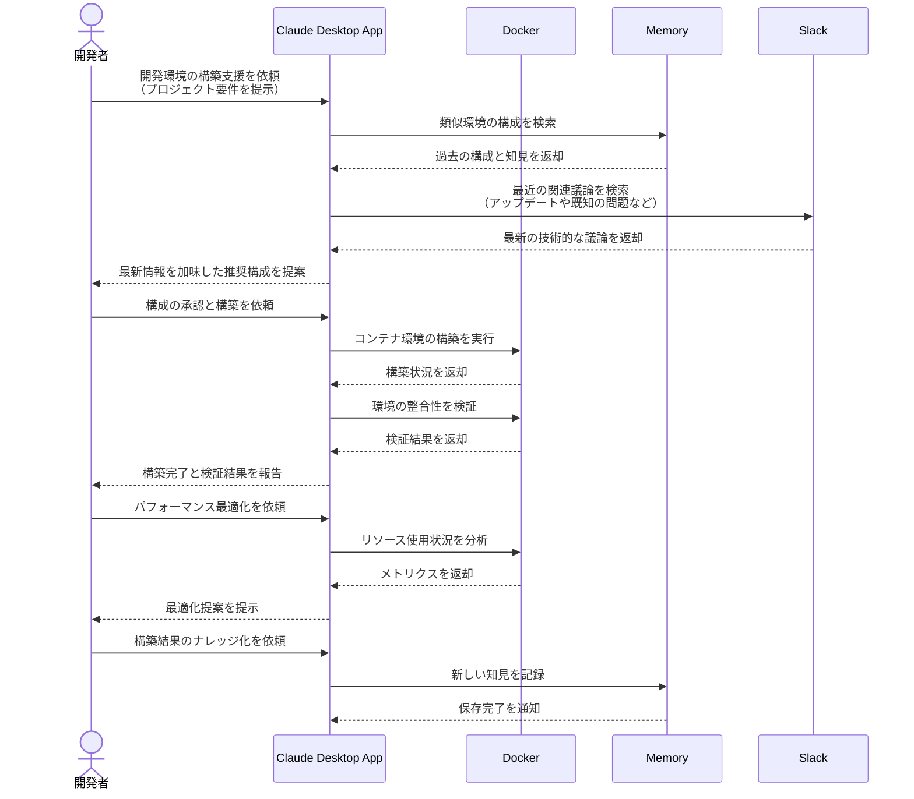

# チーム全体の開発環境を最適化する

## アイデア
Docker環境の構築・最適化を、チーム全体の開発フローと連携させながら自動化する。既存のナレッジベースと、Slackでの最新の技術的な議論を組み合わせることで、実践的なコンテナ環境を構築する。

### 具体例
マイクロサービス開発チームで、各サービスが独自のDockerfile/Compose設定を持ち、それらを連携させながら開発環境を最適化する必要がある場面。特に、新規メンバーの参画時や技術スタックのアップデート時に、環境構築の効率化が求められる。

## アーキテクチャ
| Type | Name | Role |
|--|--|--|
| Client | Claude Desktop App | 開発環境構築の対話型アシスタント |
| Server | Docker | コンテナ環境の構築と管理 |
| Server | Memory | 環境構築のナレッジベース |
| Server | Slack | 最新の技術的な議論の収集 |

## 思考プロセス

### 対象の活動の価値は何か
- Dev ContainersやCursorとの違いは、以下の点で価値を創出:
    - チーム全体での環境の一貫性担保
    - 実際のコンテナ環境の構築と検証の自動化
    - パフォーマンス最適化の提案と実装
    - ナレッジベースと最新の議論を組み合わせた実践的な環境設定

### 価値を妨げる課題は何か
- 各サービスの依存関係の複雑さ
- チームメンバー間での環境差異
- リソース使用の最適化
- 頻繁な環境更新への対応

### なぜ課題が発生するのか、仮説推論
- マイクロサービス構成による環境の複雑化
- メンバーごとの開発マシンスペックの違い
- 技術スタックの急速な進化と更新
- 標準的なベストプラクティスと最新の技術動向の統合の難しさ