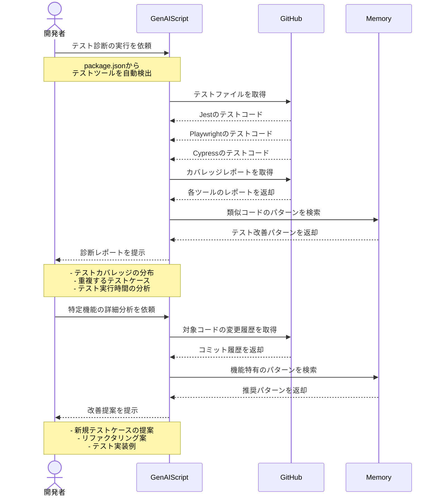

# テスト自動化の診断をする

## アイデア
GenAIScriptを活用してJest、Playwright、Cypressなどのテスト結果を統合的に分析し、テストカバレッジやテスト品質の改善ポイントを提案する。MCPの分析結果に基づき、テストケースの自動生成やリファクタリング提案も行う。

### 具体例
大規模なWebアプリケーション開発で、ユニットテスト（Jest）、E2Eテスト（Playwright）、統合テスト（Cypress）が混在する環境において、テストスイート全体の品質と効率を改善したい場面

## アーキテクチャ
| Type | Name | Role |
|--|--|--|
| Client | GenAIScript | テスト分析と自動化のスクリプト実行基盤 |
| Server | GitHub | テストコードとカバレッジレポートの取得 |
| Server | Memory | テスト改善パターンの蓄積 |

## 思考プロセス

### 対象の活動の価値は何か
- 複数テストツールの統合的な分析
    - Jest：ユニットテストの詳細
    - Playwright：E2Eテストの網羅性
    - Cypress：統合テストの品質
- GenAIScriptによる自動化の利点
    - JavaScript/TypeScriptネイティブの分析
    - VS Code拡張との連携
    - プロジェクト固有の文脈理解
- テスト品質の定量的評価
    - カバレッジの重複分析
    - テスト実行時間の最適化
    - コードの変更影響度

### 価値を妨げる課題は何か
- 異なるテストツール間のデータ統合
- テストケースの重複や不足の検出
- プロジェクト固有の要件反映
- テスト実装の属人化

### なぜ課題が発生するのか、仮説推論
- ツールごとの異なるアプローチ
    - Jestの単体テスト手法
    - Playwrightのブラウザ操作
    - Cypressの統合テスト設計
- プロジェクトの成長による課題
    - テストケースの肥大化
    - 実行時間の増大
    - メンテナンスコストの上昇
- チーム運用での難しさ
    - テストノウハウの共有
    - レビュー基準の統一
    - CI/CDパイプラインの最適化