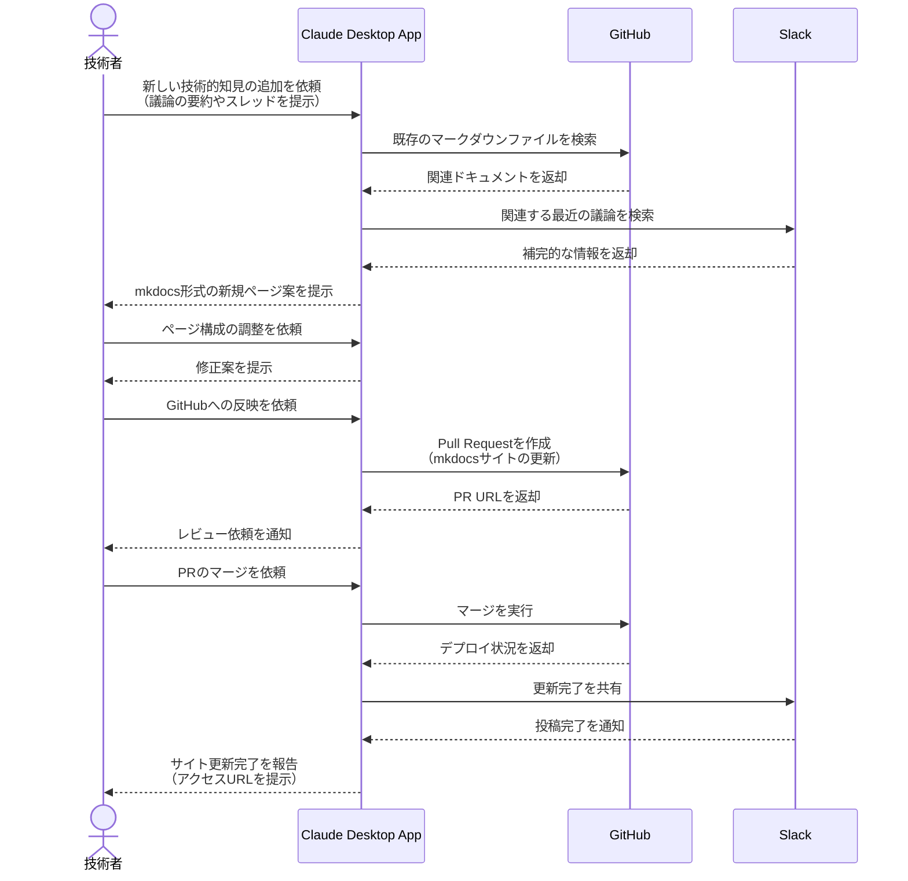

# ナレッジベースを継続的に進化させる

## アイデア
GitHubとSlackから得られる技術的知見を、mkdocsベースのドキュメントサイトとして自動的に整理・構造化する。検索性と再利用性の高いナレッジベースを、日々の開発活動の中で継続的に進化させる。

### 具体例
技術スタックが多岐にわたるマイクロサービス開発チームで、アーキテクチャの意思決定、トラブルシューティング、ベストプラクティスなどの知見を、チーム間で効率的に共有・活用する必要がある場面

## アーキテクチャ
| Type | Name | Role |
|--|--|--|
| Client | Claude Desktop App | ナレッジベース構築の対話型アシスタント |
| Server | GitHub | マークダウンファイルの管理とmkdocsサイトのホスティング |
| Server | Slack | 最新の技術的議論の収集 |

## 思考プロセス

### 対象の活動の価値は何か
- 技術的な知見の構造化と可視化による再利用性の向上
- mkdocsによる検索性の高いドキュメントサイトの自動生成
- 日々の開発活動から自然にナレッジが蓄積される仕組み
- チーム間での効率的な知見の共有と活用

### 価値を妨げる課題は何か
- 非構造化な議論や知見の効率的な整理
- ドキュメントの一貫性と品質の維持
- 既存コンテンツとの重複や競合の回避
- 継続的なメンテナンスのモチベーション維持

### なぜ課題が発生するのか、仮説推論
- Slack上の議論は文脈依存で再利用が難しい
- 個人の暗黙知を形式知化する手間とコスト
- 時間経過による情報の陳腐化
- チーム間での用語や理解度の差異