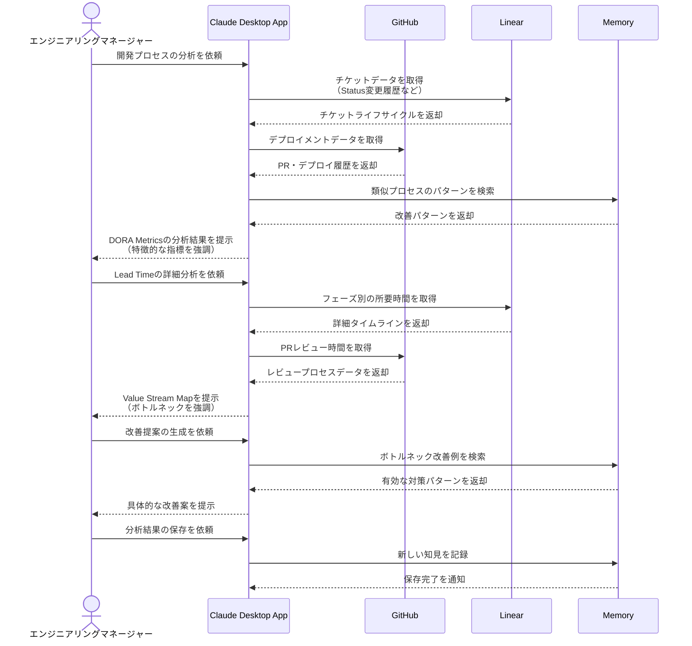

# 開発プロセスを自動で可視化する

## アイデア
DORA Metricsとバリューストリームマッピングの考え方に基づき、LinearとGitHubから得られるデータを組み合わせて開発プロセスを可視化する。開発効率のボトルネックを特定し、具体的な改善につなげる。

### 具体例
複数の機能チームが並行して開発を進める組織で、各チームのDORA Metricsを計測・比較し、開発プロセスの改善ポイントを特定する必要がある場面

## アーキテクチャ
| Type | Name | Role |
|--|--|--|
| Client | Claude Desktop App | 開発プロセス分析の対話型アシスタント |
| Server | GitHub | コミット、PR、デプロイメントデータの取得 |
| Server | Linear | チケットのライフサイクルデータの取得 |
| Server | Memory | プロセス改善パターンの蓄積 |

## 思考プロセス

### 対象の活動の価値は何か
- DORA Metricsによる定量的な開発プロセスの評価
    - Deployment Frequency：デプロイ頻度の把握
    - Lead Time for Changes：変更の所要時間分析
    - Change Failure Rate：品質への影響測定
- Value Stream Mappingによるボトルネック特定
    - Process Time：各フェーズの実作業時間
    - Wait Time：待機時間やハンドオーバー
    - Cycle Time：エンドツーエンドの所要時間
- チーム間での相対的な効率性の可視化
- データに基づく具体的な改善施策の提案

### 価値を妨げる課題は何か
- 異なるツール間でのデータの統合
- メトリクスの文脈に応じた解釈
- チーム固有の開発プロセスの違い
- 改善施策の実現可能性評価

### なぜ課題が発生するのか、仮説推論
- ツール間でのタイムスタンプや識別子の不一致
- チーム規模や技術スタックの違いによる比較の難しさ
- プロジェクトの成熟度による指標の変動
- 組織固有の制約や優先順位の存在