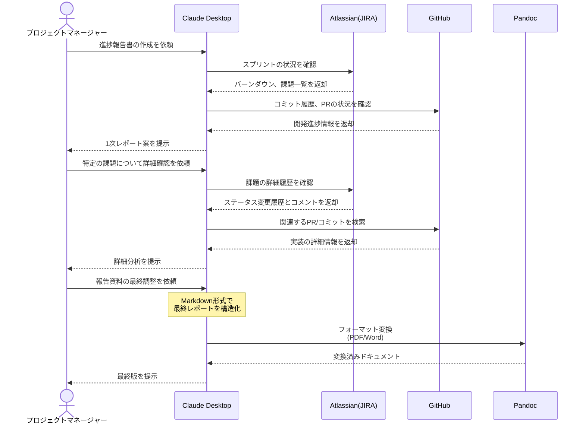

# JIRAから進捗報告資料を自動生成する

## アイデア
JIRAのチケット情報を基に、プロジェクトの進捗報告資料（予定/実績の比較、現状の課題分析、今後の見込み）を自動生成する。GitHubと連携することで、実装の詳細な進捗も含めた包括的な報告資料を作成する。

### 具体例
大規模なシステム開発プロジェクトのPMが、週次の定例会議で使用する進捗報告資料を作成する必要がある場面。複数チームの進捗や課題を、JIRAやGitHubの情報から効率的にまとめる。その後、PMが重要な課題について詳細な分析を依頼し、AIと対話しながら最終的な報告資料を作り上げていく。

## アーキテクチャ

| Type | Name | Role |
|--|--|--|
| Client | Claude Desktop App | 進捗報告資料の作成支援 |
| Server | Atlassian | プロジェクトのタスク・課題管理情報の提供 |
| Server | GitHub | 実装の詳細な進捗情報の提供 |
| Server | Pandoc | レポートの最終フォーマット変換 |

## 思考プロセス

### 対象の活動の価値は何か
- プロジェクトの現状を客観的なデータに基づいて正確に把握できる
- 複数のデータソースから情報を統合し、包括的な進捗報告が可能になる
- 定型的な資料作成作業を自動化し、PMが本質的な分析に時間を使える

### 価値を妨げる課題は何か
1. システムごとに異なる形式のデータを整理・統合する手間
2. データの解釈や課題の優先順位付けに主観が入りやすい
3. チーム間の依存関係や影響範囲の分析が複雑

### なぜ課題が発生するのか、仮説推論
1. 課題管理とソース管理が異なるシステムで運用されている
2. JIRAとGitHubの関連付けが手作業で行われている
3. プロジェクトの規模が大きくなるほど、全体像の把握が困難になる

### レポート出力の柔軟性
- Markdown: 開発チーム向けの共有・レビュー用（特定の課題について開発チームとの議論が必要な場合）
- PDF: 経営層向けの正式報告用（週次定例会議での報告資料として）
- Word(.docx): 編集可能な報告書として共有する場合（他の部門との協働編集が必要な場合）
