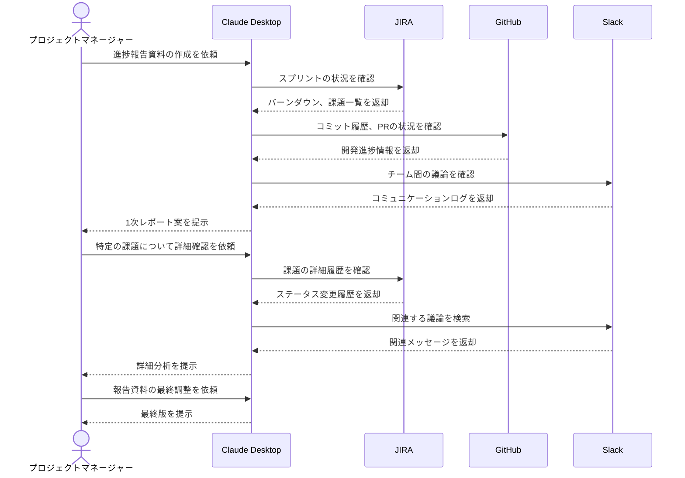

# JIRAから進捗報告資料を自動生成する

## アイデア
JIRAのチケット情報を基に、プロジェクトの進捗報告資料（予定/実績の比較、現状の課題分析、今後の見込み）を自動生成する。GitHubと連携することで、実装の詳細な進捗も含めた包括的な報告資料を作成する。

> **Note:** このアイデアの実現には、JIRAのMCPサーバーを自作する必要があります。JIRAは豊富なREST APIを提供しており、それらを活用してMCPサーバーを実装することで実現可能です。

### 具体例
大規模なシステム開発プロジェクトのPMが、週次の定例会議で使用する進捗報告資料を作成する必要がある場面。複数チームの進捗や課題を、JIRAやGitHubの情報から効率的にまとめる。

## アーキテクチャ

| Type | Name | Role |
|--|--|--|
| Client | Claude Desktop App | 進捗報告資料の作成支援 |
| Server | JIRA (要自作) | プロジェクトのタスク・課題管理情報の提供 |
| Server | GitHub | 実装の詳細な進捗情報の提供 |
| Server | Slack | 議事録やコミュニケーションログの参照 |

## 思考プロセス

### 対象の活動の価値は何か
- プロジェクトの現状を客観的なデータに基づいて正確に把握できる 
- 複数のデータソースから情報を統合し、包括的な進捗報告が可能になる 
- 定型的な資料作成作業を自動化し、PMが本質的な分析に時間を使える

### 価値を妨げる課題は何か
1. 複数システムに分散した情報の収集と整理に時間がかかる 
2. データの解釈や課題の優先順位付けに主観が入りやすい 
3. チーム間の依存関係や影響範囲の分析が複雑

### なぜ課題が発生するのか、仮説推論
1. プロジェクト管理ツール、コミュニケーションツール、ソース管理が別々のシステムで運用されている 
2. 数値データとコミュニケーションログの統合分析が手作業で行われている 
3. プロジェクトの規模が大きくなるほど、全体像の把握が困難になる