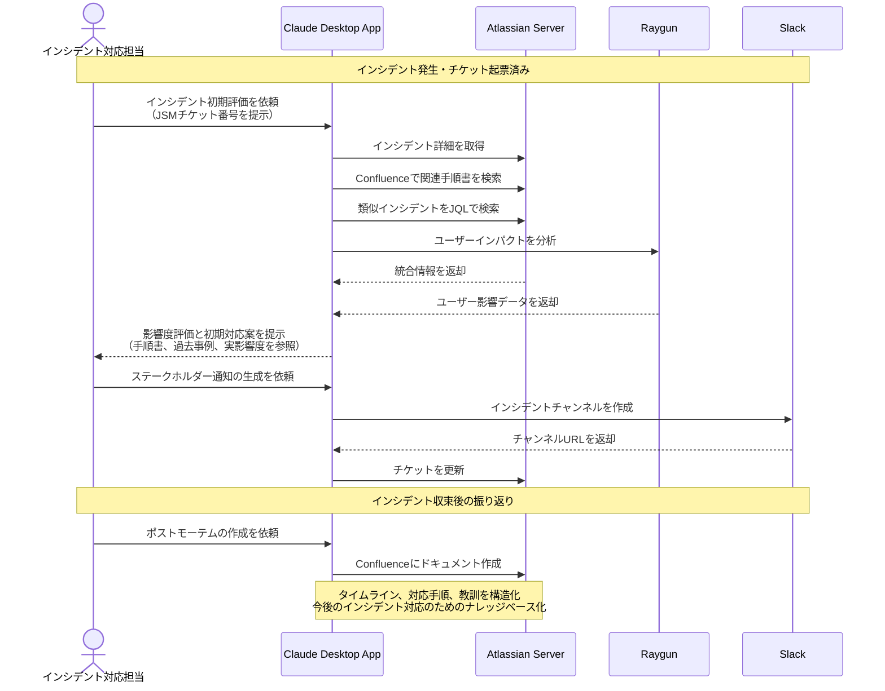

# インシデント対応の意思決定を支援する

## アイデア
Jira Service Managementのインシデント履歴とConfluenceのナレッジベースを活用し、過去の対応経験に基づいた意思決定支援により、インシデント対応の質と速度を向上させる。影響度や緊急度に応じた適切なプロセスを提案し、ステークホルダーコミュニケーションを最適化する。Raygunによるリアルユーザーモニタリングを活用し、ユーザーへの実際の影響を定量的に把握する。

### 具体例
大規模SaaSプラットフォームで認証システムの遅延が発生し、複数の顧客から問い合わせが入った際に、過去の類似インシデントの対応履歴と関連手順書から適切な対応プロセスを提案し、リアルタイムのユーザーインパクト分析に基づいて必要なステークホルダーへの情報展開を支援する場面

## アーキテクチャ
| Type | Name | Role |
|--|--|--|
| Client | Claude Desktop App | インシデント対応の意思決定支援 |
| Server | Atlassian | インシデント管理、対応履歴、ナレッジベースの活用 |
| Server | Raygun | リアルユーザーモニタリングとインパクト分析 |
| Server | Slack | ステークホルダー通知の配信 |

## 思考プロセス

### 対象の活動の価値は何か
- インシデント対応の意思決定の迅速化と品質向上
    - 過去の類似事例からの学習
    - Confluenceナレッジベースの活用
    - リアルタイムのユーザーインパクト分析
    - コンテキストに応じた最適な対応手順の提案
    - ステークホルダーコミュニケーションの最適化

- インシデント対応プロセスの標準化と効率化
    - 一貫性のある対応フローの実現
    - 必要な情報の自動収集と整理
    - 適切なエスカレーションの支援
    - ポストモーテムの構造化された記録

### 価値を妨げる課題は何か
- インシデントの影響度や緊急度の適切な評価
  - 技術的な影響と実ユーザーへの影響の把握
  - 過去の類似インシデントの効率的な特定と活用
  - 関連する手順書や知識ベースの適切な参照
- ステークホルダー間での情報共有とコミュニケーション
  - 影響を受けるユーザー層の特定
  - 適切なコミュニケーションレベルの判断
  - タイムリーな情報更新
- 再発防止策の実効性確保と追跡

### なぜ課題が発生するのか、仮説推論
- インシデント対応時の時間的プレッシャー
- 知識ベースと実際の対応経験の効果的な統合の難しさ
- 技術的な問題とビジネスインパクトの相関分析の複雑さ
- 組織の成長による対応プロセスの複雑化
- インシデント固有のコンテキストの理解と共有の難しさ