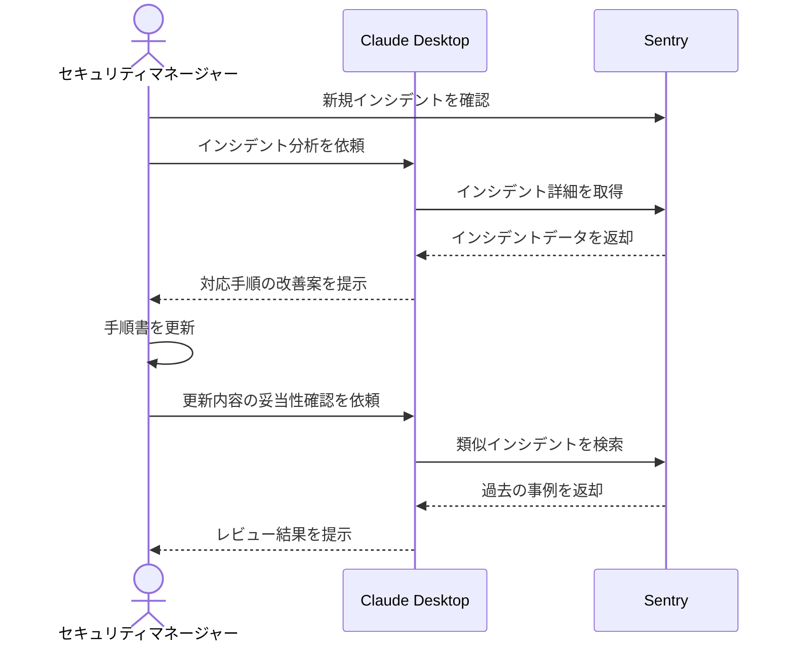

# インシデント対応手順を最新化する

## アイデア
SentryとGitHubを連携させ、実際のインシデントデータを基にした対応手順の継続的な改善と、バージョン管理された手順書の効率的な更新を実現する

### 具体例
セキュリティチームのマネージャーが、Sentryで検知された新種のインシデントパターンを分析し、GitHubで管理している対応手順書を迅速かつ適切に更新できる

## アーキテクチャ
| Type | Name | Role |
|--|--|--|
| Client | Claude Desktop App | インシデント分析と手順更新の支援 |
| Server | Sentry | インシデントデータの収集と分析 |

## 思考プロセス

### 対象の活動の価値は何か
- インシデント発生時の対応時間の短縮 
- 手順の標準化による対応品質の向上 
- チーム全体の対応力強化

### 価値を妨げる課題は何か
1. 新しい脅威に対する対応手順が未整備 
2. 手順書の更新が属人的で統一感がない 
3. 改訂した手順の有効性を事前に検証できない 

### なぜ課題が発生するのか、仮説推論
1. 脅威対応の問題
    - 脅威情報の収集と分析に時間がかかる
    - 対応手順への反映が後手に回りがち 

2. ドキュメント管理の問題
    - 更新の必要性を適時に把握できていない
    - レビュー・承認プロセスが煩雑 

3. 検証の問題
    - 実環境での訓練機会が限られている
    - 手順の実効性を評価する基準が不明確