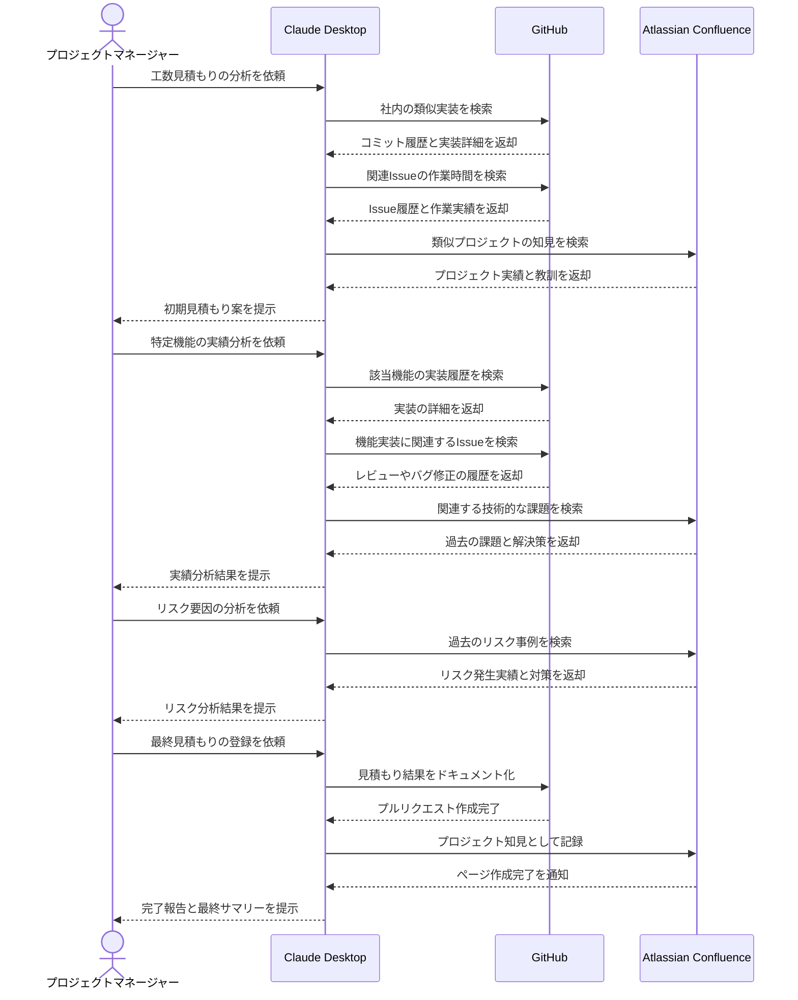

# プロジェクト工数見積もりを高精度化する

## アイデア
実装履歴とプロジェクト知見を組み合わせて、より正確な工数見積もりを実現する。GitHubの開発履歴・Issue管理情報と、Confluenceに蓄積されたプロジェクト実績を総合的に分析し、実態に即した見積もりを作成する。

### 具体例
新規のマイクロサービス開発プロジェクトの工数見積もり。社内の類似プロジェクトについて、実装履歴、作業記録、プロジェクト知見を分析し、より現実的な見積もりを作成する。実装工数だけでなく、レビューや障害対応を含めた総合的な評価を行う。

## アーキテクチャ

| Type | Name | Role |
|--|--|--|
| Client | Claude Desktop App | 工数分析と見積もり支援 |
| Server | GitHub | 開発履歴とIssue管理情報の分析 |
| Server | Atlassian Confluence | プロジェクト実績と知見の分析 |

## 思考プロセス

### 対象の活動の価値は何か
1. プロジェクトの予算・スケジュール管理の信頼性向上
    - 実装工数だけでなく実際の作業時間を含めた現実的な見積もり
    - 技術的な課題や運用面の工数も含めた包括的な工数把握 

2. 見積もり作業の効率化
    - 実績データに基づく客観的な見積もり手法の確立
    - プロジェクト知見の活用による精度の向上

### 価値を妨げる課題は何か
1. 実態を反映した工数把握の困難さ
    - 実装以外の作業時間の定量化が困難
    - 中断・再開を含む実際の作業時間の把握が不正確 

2. 見積もり精度の属人性
    - 技術的な課題の影響度評価が経験則に依存
    - チーム特性による工数差異の定量化が困難

### なぜ課題が発生するのか、仮説推論
1. データ収集と分析の不完全性
    - 実装履歴と実際の作業時間の乖離
    - プロジェクト固有の制約条件の考慮不足 

2. 包括的な工数把握の仕組み不足
    - 実績データとプロジェクト知見の統合分析基盤の未整備
    - チーム特性や開発プロセスの影響評価の困難さ