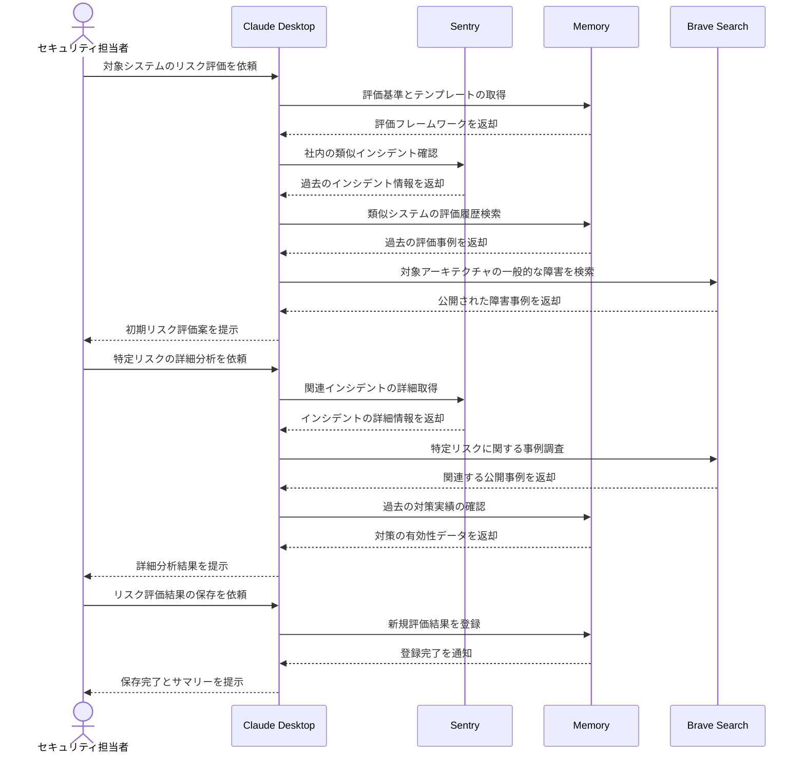

# リスクアセスメントを高度化する

## アイデア
Sentry Server、Memory Server、そしてBrave Search Serverを組み合わせて、より包括的で客観的なリスクアセスメントを実現する。社内の過去のインシデント情報と、一般的に報告されている障害情報を組み合わせることで、より確実な評価を可能にする。

### 具体例
クラウドサービスの新規導入に際してセキュリティチームが実施するリスクアセスメント。社内の過去のインシデント履歴や類似システムでの評価実績に加えて、対象アーキテクチャで一般的に報告されている障害事例も参照しながら、包括的なリスク評価を行う。

## アーキテクチャ

| Type | Name | Role |
|--|--|--|
| Client | Claude Desktop App | リスク分析と評価支援 |
| Server | Sentry | 社内のインシデント・エラー情報の提供 |
| Server | Memory | リスク評価基準と過去の評価結果の保存 |
| Server | Brave Search | 一般的な障害事例の調査 |

## 思考プロセス

### 対象の活動の価値は何か
1. リスクの見える化と客観的評価
    - 経営層の投資判断や対策優先順位付けのための定量的評価
    - 監査対応や説明責任のためのプロセス透明性確保 

2. 過去の知見の活用による評価品質の向上
    - 社内外の障害事例や対策有効性からの学習による確実な評価
    - 組織の内部知見と外部事例を組み合わせた包括的な評価

### 価値を妨げる課題は何か
1. 情報の分散と統合の困難さ
    - 社内の障害情報、脆弱性情報、監査記録など、情報の分散
    - 社内情報と外部事例の関連付けや横断的分析の手作業化 

2. リスク評価の標準化と一貫性の維持
    - 評価者による判断基準のばらつき
    - 新しいリスクへの評価基準確立の遅れ

### なぜ課題が発生するのか、仮説推論
1. 情報源の多様化と分断
    - システムごとに異なる監視・ログ基盤の採用
    - 社内ナレッジと外部情報の統合的な分析基盤の不足 

2. 評価プロセスの属人化
    - 標準化された評価基準の維持管理の困難さ
    - 新しい技術や脅威に対する評価経験の不足