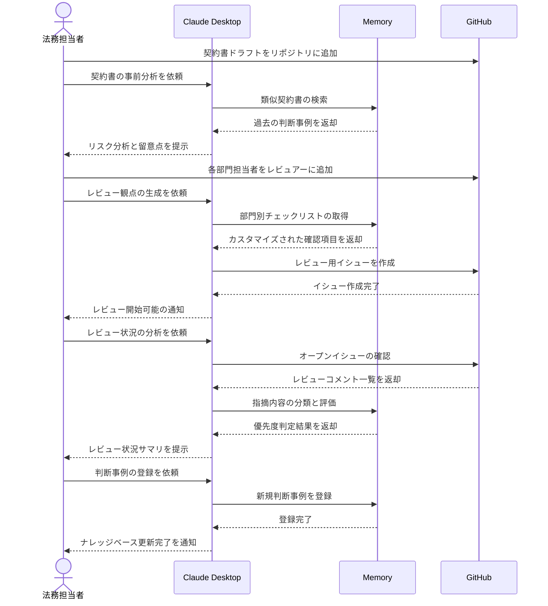

# 契約書の法務確認業務を効率化する

## アイデア
Memory ServerとGitHub Serverを組み合わせて、部門横断的な契約書レビュー業務を効率化する。契約書レビュー履歴のナレッジベース化と、部門間の並行レビューの円滑化を実現する。

### 具体例
クラウドサービス導入に関する契約書のレビューにおいて、法務部門・情報システム部門・セキュリティ部門が並行して確認を行う必要があるケース。各部門の指摘事項を一元管理し、過去の類似契約での判断を参照しながら、効率的なレビューを実現する。

## アーキテクチャ

| Type | Name | Role |
|--|--|--|
| Client | Claude Desktop App | 契約書の分析と類似事例の検索・比較 |
| Server | Memory | 契約書レビュー履歴と判断基準のナレッジベース |
| Server | GitHub | レビュー指摘事項の管理とコラボレーション |

## 思考プロセス

### 対象の活動の価値は何か
1. リスク低減とコンプライアンス確保
    - 法的リスクやデータ漏洩リスクの最小化による事業の安定性確保
    - コンプライアンス違反による罰則や評判低下の防止 

2. 適切なコスト管理と投資対効果の最大化
    - 限られた予算内での最適なサービスレベルの確保
    - 無駄な支出や想定外のコストの防止

### 価値を妨げる課題は何か
1. 複雑な契約内容の解釈と理解の困難さ
    - 法務、技術、セキュリティなど多岐にわたる専門知識の必要性
    - 契約書の文言と実際のサービス内容との対応関係の不明確さ 

2. 関係部門間のコミュニケーションの非効率性
    - 多くのステークホルダーの意見調整に要する時間
    - 統一された評価基準の策定の困難さ

### なぜ課題が発生するのか、仮説推論
1. 専門知識の分散と統合の困難さ
    - 各部門が異なる専門性を持ち、相互理解が困難
    - 過去の判断事例が体系的に蓄積・共有されていない 

2. レビュープロセスの非構造化
    - 複数部門の並行レビューによる重複や漏れの発生
    - レビュー指摘事項の追跡と管理の煩雑さ