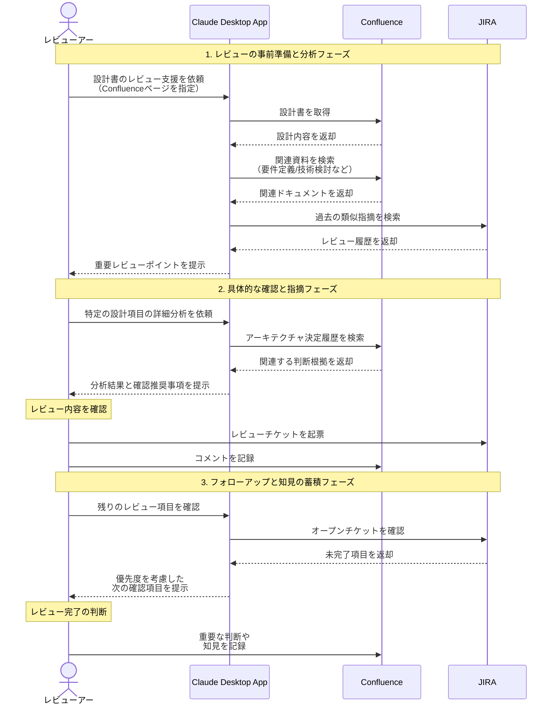

# 設計書レビューを効率化する

## アイデア
Confluenceを中心とした設計書管理とJiraによるレビュー管理を統合し、レビューナレッジの効果的な活用と、指摘事項の追跡可能性を実現する。チーム間で蓄積された知見を活かしながら、設計品質の向上を図る。

### 具体例
大規模な基幹システムリプレイス案件で、マイクロサービス化への移行とレガシーシステム連携に関するアーキテクチャ設計書のレビューを行う場面。過去の類似プロジェクトの知見を活用しながら、設計上の重要ポイントを効率的に特定する。

## アーキテクチャ
| Type | Name | Role |
|--|--|--|
| Client | Claude Desktop App | レビュー支援と指摘事項の分析 |
| Server | Confluence | 設計書・ナレッジ管理とパターン蓄積 |
| Server | JIRA | レビューチケット管理と追跡 |

## 思考プロセス

### 対象の活動の価値は何か
- アーキテクチャ設計品質の向上と手戻りの防止
    - 要件との整合性確保
    - 技術的な問題の早期発見
    - 組織的な知見の効果的な活用
- レビュープロセスの効率化と標準化
    - レビューパターンのテンプレート化
    - 指摘事項の追跡可能性
    - チーム間での知見共有

### 価値を妨げる課題は何か
- 複数ドキュメント間の整合性確認の負荷
- レビュー指摘の品質とばらつき
- 設計意図の理解と適切な指摘の困難さ
- パターン化された知見の更新と進化

### なぜ課題が発生するのか、仮説推論
- 設計の複雑化と相互依存関係の増加
    - マイクロサービス化による設計の複雑化
    - レガシーシステムとの連携要件
- レビュー品質の属人化
    - レビューアの経験や知識への依存
    - チェックポイントの暗黙知化
- プロジェクト固有の制約
    - アーキテクチャ決定の背景理解
    - 技術選定の文脈把握