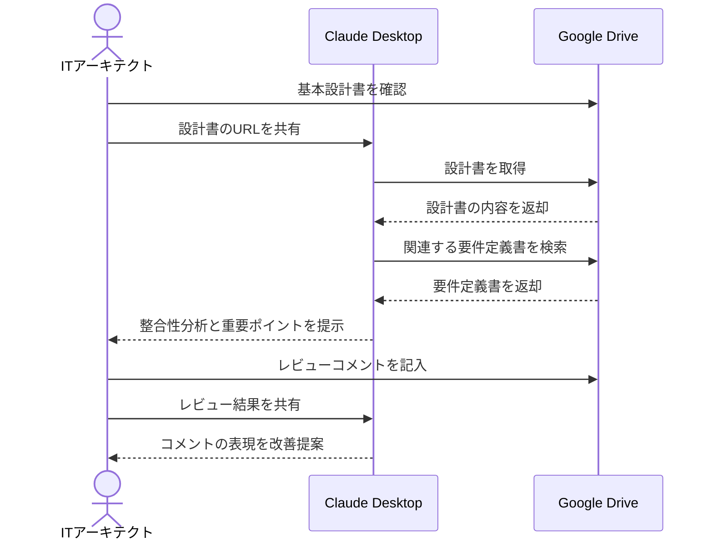

# 設計書レビューを効率化する

## アイデア
Google Driveに格納された設計書を効率的に分析し、要件定義書との整合性チェックや、過去の類似プロジェクトでの指摘事項との照合を自動化することで、レビュー品質を向上させる

### 具体例
基本設計書の提出を受けたITアーキテクトが、要件定義書やベストプラクティスとの差分を自動的に分析し、重点的にレビューすべきポイントを特定できる

## アーキテクチャ
| Type | Name | Role |
|--|--|--|
| Client | Claude Desktop App | 設計書の分析と重要ポイントの提示 |
| Server | Google Drive | 設計書および関連ドキュメントの取得 |

## 思考プロセス

### 対象の活動の価値は何か
- 設計品質の向上による手戻りの防止 
- 技術的な問題の早期発見 
- プロジェクト全体のリスク低減

### 価値を妨げる課題は何か
1. 複数の要件定義書や関連ドキュメントの横断的な確認が必要 
2. レビュー時の見落としや偏りが発生しやすい 
3. レビュー指摘の背景や意図が伝わりにくい 

### なぜ課題が発生するのか、仮説推論
1. 横断確認の問題
    - ドキュメントが散在し、関連情報の探索に時間がかかる
    - 過去の類似プロジェクトの知見を活かせていない 

2. レビュー品質の問題
    - 人的リソースの制約で十分な時間が取れない
    - レビューアの経験や知識に依存する部分が大きい 

3. コミュニケーションの問題
    - 指摘事項の文脈や重要度が明確に伝わらない
    - 開発チームとの認識齟齬が発生しやすい