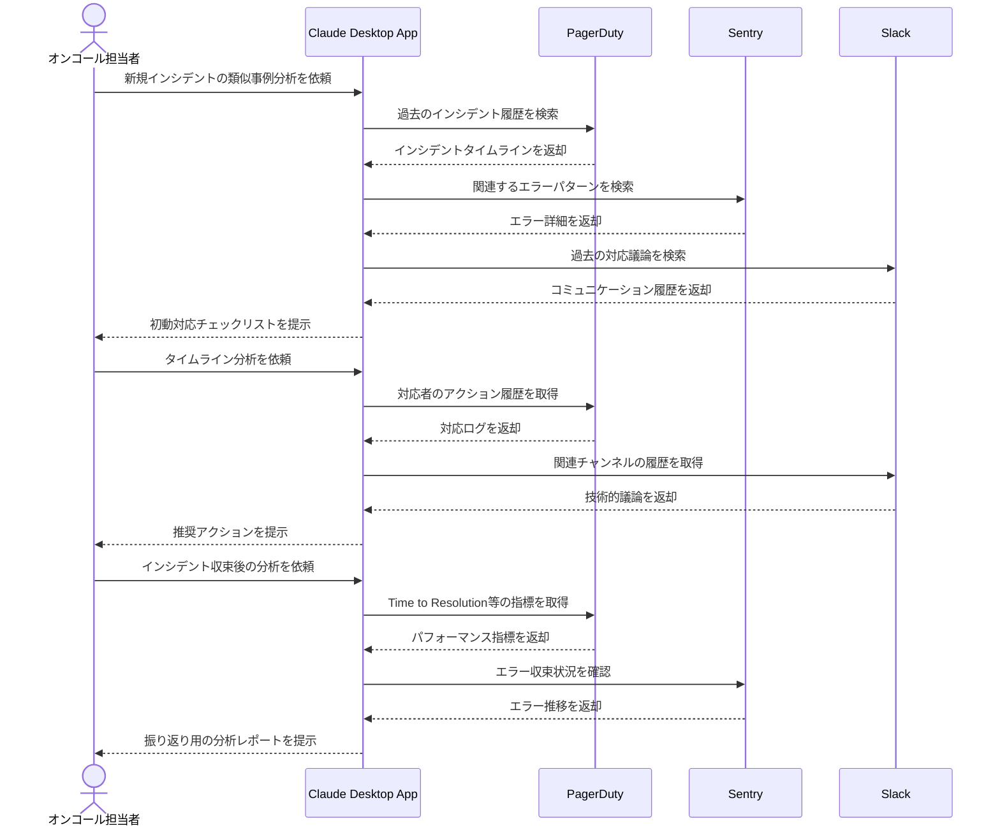

# 障害対応履歴の活用を最適化する

## アイデア
PagerDutyのタイムラインデータ、Sentryのエラー詳細、Slackのコミュニケーション履歴を統合的に分析し、インシデント対応ナレッジを体系化する。過去の対応パターンを学習し、類似インシデントの初動対応を効率化する。

### 具体例
マイクロサービス環境で深夜にクリティカルなインシデントが発生した際に、過去の類似インシデントの対応履歴から、初動対応のチェックリストと解決の手がかりを即座に提供する場面

## アーキテクチャ
| Type | Name | Role |
|--|--|--|
| Client | Claude Desktop App | インシデント分析の対話型アシスタント |
| Server | PagerDuty | インシデントタイムラインと対応記録の取得(要自作Server) |
| Server | Sentry | エラー詳細とコンテキストの取得 |
| Server | Slack | 対応時のコミュニケーション履歴の分析 |

## 思考プロセス

### 対象の活動の価値は何か
- インシデント対応時間（MTTR）の短縮
- オンコール担当者の精神的負担の軽減
- 組織的な障害対応ナレッジの蓄積
- データに基づく対応プロセスの改善

### 価値を妨げる課題は何か
- 複数ツールに分散した情報の統合
- コンテキストに応じた適切な情報の抽出
- 深夜帯での迅速な判断支援
- 類似性判定の精度向上

### なぜ課題が発生するのか、仮説推論
- インシデント情報の分散化
    - PagerDuty：タイムラインと対応記録
    - Sentry：技術的なエラー詳細
    - Slack：チーム間のコミュニケーション
- 時間経過による状況変化
    - インフラ構成の更新
    - 対応手順の陳腐化
    - チームメンバーの変更
- 深夜対応での認知負荷
    - 情報収集の困難さ
    - 判断の不確実性
    - コミュニケーションの制約