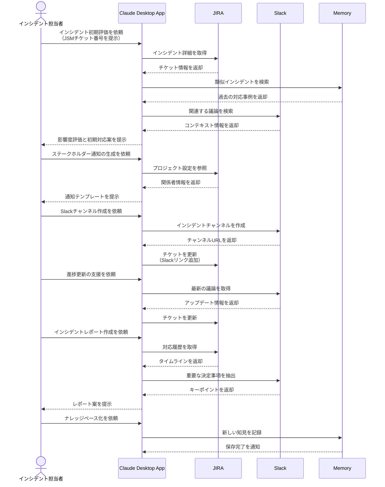

# インシデント対応の意思決定を支援する

## アイデア
Jira Service ManagementとSlackの連携を強化し、過去の対応ナレッジを活用した意思決定支援により、インシデント対応の質と速度を向上させる。影響度や緊急度に応じた適切なプロセスを提案し、ステークホルダーコミュニケーションを最適化する。

### 具体例
大規模SaaSプラットフォームで認証システムの遅延が発生し、複数の顧客から問い合わせが入った際に、過去の類似インシデントの分析から適切な対応プロセスを提案し、必要なステークホルダーへの情報展開を支援する場面

## アーキテクチャ
| Type | Name | Role |
|--|--|--|
| Client | Claude Desktop App | インシデント対応の意思決定支援 |
| Server | JIRA | インシデント管理とワークフロー実行(要Server自作) |
| Server | Slack | リアルタイムコミュニケーション |
| Server | Memory | インシデント対応ナレッジの活用 |

## 思考プロセス

### 対象の活動の価値は何か
- インシデント対応の意思決定の迅速化と品質向上
    - 過去の類似事例からの学習
    - コンテキストに応じた最適な対応手順の提案
    - ステークホルダーコミュニケーションの最適化
- インシデント対応プロセスの標準化と効率化
    - 一貫性のある対応フローの実現
    - 必要な情報の自動収集と整理
    - 適切なエスカレーションの支援

### 価値を妨げる課題は何か
- インシデントの影響度や緊急度の適切な評価
- 過去の類似インシデントの効率的な特定と活用
- ステークホルダー間での情報共有とコミュニケーション
- 再発防止策の実効性確保と追跡

### なぜ課題が発生するのか、仮説推論
- インシデント対応時の時間的プレッシャー
- 関連情報が複数のシステムに分散
- 組織の成長による対応プロセスの複雑化
- インシデント固有のコンテキストの理解と共有の難しさ