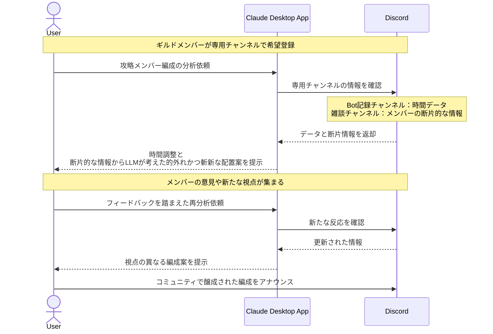

# ゲーム攻略の予定を楽しく共有する

## アイデア
Discord上の特定チャンネルのデータを分析し、ゲーム攻略メンバーの編成を提案。活動時間はBotの記録から正確に分析する一方、ロール提案は断片的な情報からの推測を織り交ぜる。時には的外れな分析が思わぬ可能性を生むことも 

### 具体例
大規模オンラインゲームで、30人規模のレイドコンテンツに挑むギルドが、既存のBotが記録している基本情報（オンライン時間など）を基盤に、チャンネルに散らばったメンバー情報から編成案を導き出す。断片的な情報からの推論が、思いがけない攻略アプローチを見出すきっかけに 

## アーキテクチャ

| Type | Name | Role |
|--|--|--|
| Client | Claude Desktop App | パーティ編成の分析と提案 |
| Server | Discord (Custom) | 既存の実績記録Botと連携する自作Server |

## 思考プロセス

### 対象の活動の価値は何か
- チームワークの達成感 
    - オンラインゲームのハイエンドコンテンツは、多人数での緻密な連携が必要。活動時間の正確な把握と、断片的な情報から導かれる意外性のあるロール配置が、独自の「共同体験」を生む 
- コミュニティの維持・発展 
    - メンバーの活動パターンと、分析から導かれる思いがけない組み合わせが、コミュニティの新しい一面を引き出す 

### 価値を妨げる課題は何か
- 情報の精度差 
    - 既存Botによる時間データは正確だが、その他の情報は断片的で不完全。この差を活かした分析が必要 
- チャンネルの多様性 
    - 情報が複数のチャンネルに分散。時間データは集約されているが、その他は雑談の中から拾い上げる必要がある 

### なぜ課題が発生するのか、仮説推論
- 時間データは自動記録できても、メンバーの特性は機械的に判断できない 
- コミュニティの自然な会話から、予想外の組み合わせが生まれる可能性がある 
