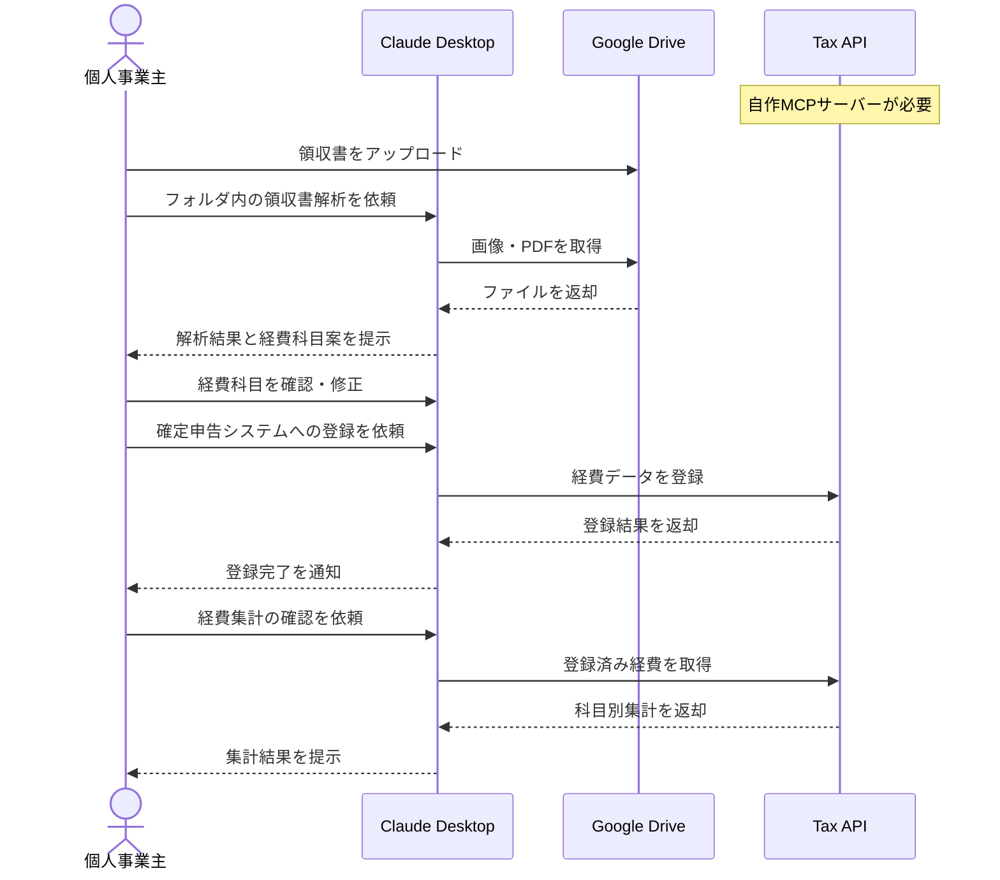

# デジタル領収書から経費を自動登録する

## アイデア
Google DriveとカスタムのTax API Serverを組み合わせて、個人事業主のための経費の自動登録を実現する。Claudeの画像認識能力を活用して領収書を解析し、確定申告システムに自動連携する。

> **Note:** このアイデアの実現には、確定申告支援サービス用のMCPサーバーを自作する必要があります。主要な確定申告支援サービスはAPIを提供しており、それらを活用してMCPサーバーを実装することで実現可能です。

### 具体例
フリーランスのクリエイターが、クラウドサービスの利用料やオンライン購入の領収書を自動収集。形式の異なる領収書をClaudeが解析し、確定申告支援サービスに自動連携することで、経費計上の手間を大幅に削減する。

## アーキテクチャ

| Type | Name | Role |
|--|--|--|
| Client | Claude Desktop App | 領収書の画像認識と解析 |
| Server | Google Drive | 領収書データの保存と管理 |
| Server | Tax API (要自作) | 確定申告支援サービスとの連携 |

## 思考プロセス

### 対象の活動の価値は何か
1. 確定申告の正確性向上と効率化
    - 経費の見落としや入力ミスの防止
    - 適切な経費科目への自動分類による作業時間の削減 

2. 経費データの一元管理
    - 経費計上漏れの防止
    - 科目別の経費集計の自動化

### 価値を妨げる課題は何か
1. フォーマットが統一されていないデータの処理
    - 画像の品質やフォーマットの違い
    - 記載項目の位置や表記の揺れ 

2. 適切な経費科目の判断
    - 取引内容から適切な経費科目の判断
    - 経費計上可否の判断

### なぜ課題が発生するのか、仮説推論
1. データ形式の多様性
    - サービスごとに異なる領収書フォーマット
    - 画質や撮影方法による可読性の違い 

2. 確定申告の専門知識の必要性
    - 経費科目の判断基準の複雑さ
    - 税務上の取り扱いの違いへの対応