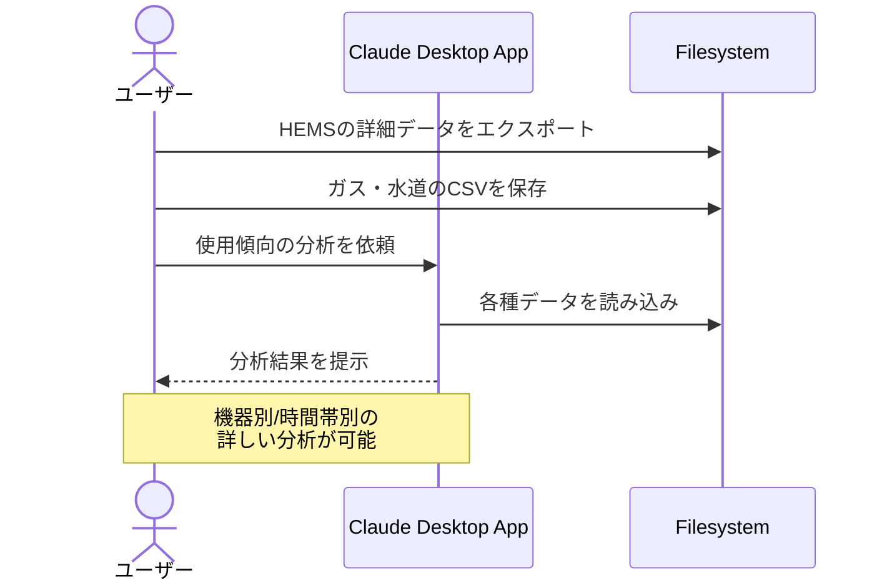

# 光熱費CSVから傾向を分析する

## アイデア
HEMSから得られる詳細な電力使用データを分析し、機器ごとや時間帯ごとの使用傾向を把握。月次のガス・水道使用量と組み合わせて、光熱費全体の傾向を理解する。

### 具体例
賃貸マンションに住む会社員。HEMSで電力使用量を常時モニタリングしつつ、ガス・水道はマイページから月次データをダウンロード。時間帯ごとの使用パターンを分析し、生活スタイルと使用量の関係を理解する。

## アーキテクチャ

| Type | Name | Role |
|--|--|--|
| Client | Claude Desktop App | データ分析と使用傾向の説明 |
| Server | Filesystem | HEMSデータとCSVファイルの読み込み |

## 思考プロセス

### 対象の活動の価値は何か
- 機器ごと・時間帯ごとの詳細な使用パターン把握
- 生活習慣と電力使用量の直接的な関連付け
- 電気・ガス・水道を含めた光熱費全体の理解

### 価値を妨げる課題は何か
1. データ形式が統一されておらず、HEMSと各社CSVの結合が手間 
2. データ量が多く、手動での傾向分析が困難 
3. 特定の行動と消費量の関係を読み取るのに時間がかかる

### なぜ課題が発生するのか、仮説推論
- HEMSと各社システムが独立して運用されている
- 複数のデータソースを横断的に分析する仕組みがない
- データを見ても具体的な使用シーンの把握が難しい