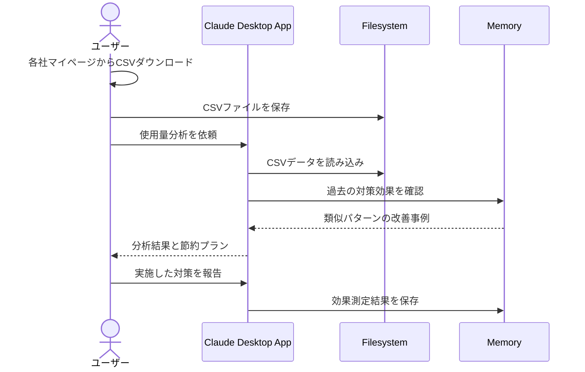

# 光熱費CSVから傾向を分析する

## アイデア
電気・ガス・水道会社のマイページからダウンロードしたCSVファイルを分析。過去の使用量データと気象データを組み合わせて、効果的な節約プランを提案し、実施した対策の効果も追跡。

### 具体例
賃貸マンションに住む会社員。毎月初めに各社のマイページからCSVをダウンロードし分析。在宅勤務の増加で上がった光熱費の原因を特定し、効果的な節約方法を見つける。

## アーキテクチャ

| Type | Name | Role |
|--|--|--|
| Client | Claude Desktop App | データ分析と節約プランの提案 |
| Server | Filesystem | CSVファイルの読み込みと保存 |
| Server | Memory | 実施した対策と効果の履歴保存 |

## 思考プロセス

### 対象の活動の価値は何か
- 複数サービスの使用量を統合分析による全体把握
- 生活パターンの変化と使用量の関係性理解
- 対策効果の定量的な確認による効率的な改善

### 価値を妨げる課題は何か
1. 各社マイページでの個別ダウンロードの手間 
2. 月単位データのため、詳細な使用パターン把握が困難 
3. 気象条件など外部要因の影響評価が不正確

### なぜ課題が発生するのか、仮説推論
- 各社が独自のマイページシステムを運用している
- より細かい時間単位のデータは提供されていない
- 外部データとの組み合わせは手動での紐付けが必要