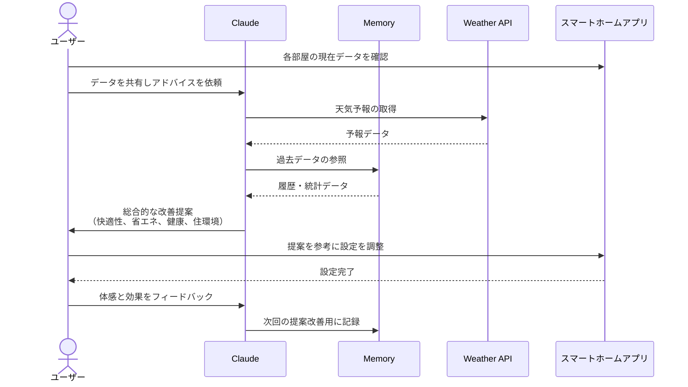

# 室温管理で快適と健康を実現する

## アイデア
快適性、省エネ、健康、住環境の4つの観点から室温を総合的に管理します。天候APIと連携して室温・湿度を予測制御し、電気代の削減と結露防止を実現。さらに睡眠の質やヒートショック予防にも配慮した温度管理を提案します。

### 具体例
築10年の賃貸マンションで暮らす夫婦。寝室は北向きで冬場は結露が気になり、脱衣所との温度差で体調を崩すことも。光熱費の上昇も課題でしたが、快適性と健康面での不安から空調の使用を控えられずにいました。

## アーキテクチャ

| Type | Name | Role |
|--|--|--|
| Client | Claude Desktop App | ユーザーとの対話、総合的なアドバイス |
| Server | Memory | 室温・湿度・電気代の履歴、健康データの管理 |
| Server | Weather | 天候予報と室内環境予測 |

## 思考プロセス

### 対象の活動の価値は何か
- 部屋ごとの快適な温度湿度による生活の質向上 
- エネルギー効率の最適化による電気代の大幅削減 
- 温度差の緩和によるヒートショック予防 
- 結露防止による住環境の維持と資産価値の保護

### 価値を妨げる課題は何か
- 快適性・省エネ・健康・住環境の相反する要求 
- 天候変化による室内環境の予測困難さ 
- 生活パターンに応じた適切な温度管理の複雑さ

### なぜ課題が発生するのか、仮説推論
- 複数の要因（温度・湿度・風通し）の関係性が複雑 
- 季節や天候による外部環境の変化が大きい 
- 部屋ごとの環境差（日当たり、断熱性）が存在する