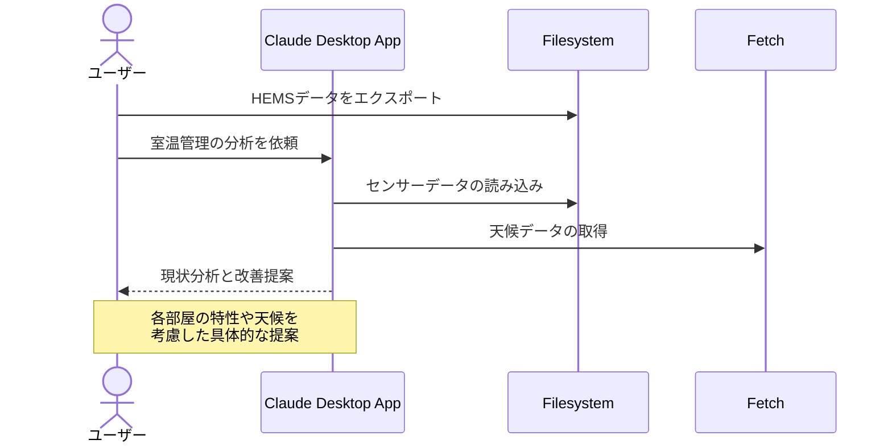

# 室温管理で快適と健康を実現する

## アイデア
HEMSの各種センサー（温度、湿度、人感、CO2など）から得られるデータと天候情報を組み合わせて室内環境を分析。快適性、健康、省エネの観点から適切な温度管理を実現する。

### 具体例
築10年の賃貸マンションで暮らす夫婦。寝室は北向きで冬場は結露が気になり、脱衣所との温度差で体調を崩すことも。HEMSで各部屋の環境を可視化し、天候予報も考慮しながら適切な温度管理を実現したい。

## アーキテクチャ

| Type | Name | Role |
|--|--|--|
| Client | Claude Desktop App | データ分析と改善提案 |
| Server | Filesystem | HEMSデータの読み込み |
| Server | Fetch | 天候情報の取得 |

## 思考プロセス

### 対象の活動の価値は何か
- 部屋ごとの快適な温度湿度による生活の質向上 
- エネルギー効率の最適化による電気代の削減 
- 温度差の緩和によるヒートショック予防 
- 結露防止による住環境の維持

### 価値を妨げる課題は何か
- 快適性・省エネ・健康のバランス取りが難しい 
- 部屋ごとの温度差の解消方法がわからない 
- 季節や天候の変化への事前対応が困難

### なぜ課題が発生するのか、仮説推論
- 複数の要因（温度・湿度・風通し）の関係性が複雑 
- 季節や天候による外部環境の変化が大きい 
- 部屋ごとの環境差（日当たり、断熱性）が存在する