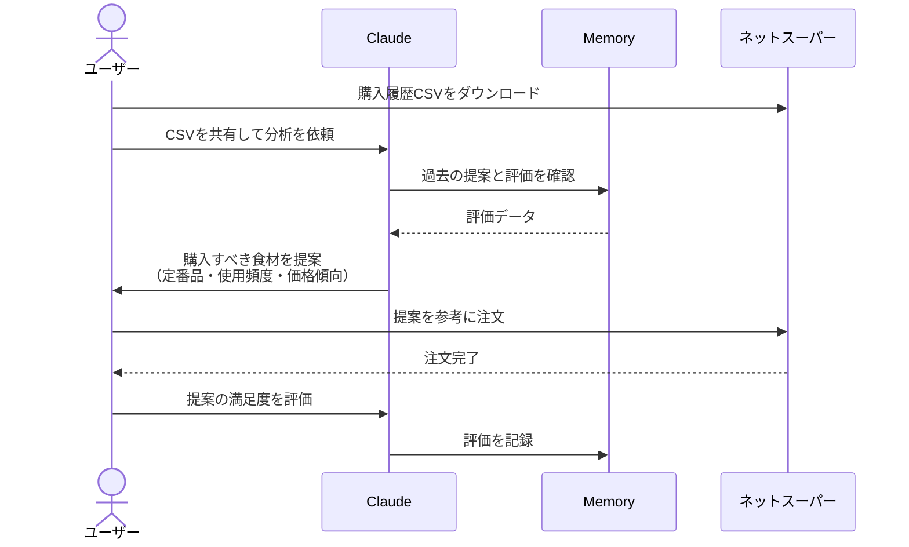

# 購入履歴で賢い食材選びをする

## アイデア
ネットスーパーからダウンロードした購入履歴CSVを分析し、定番食材の買い時と特売品の活用方法を提案します。毎回の選択の手間を減らしながら、食費の節約と食事の幅を広げることができます。

> **Note:** CSVとありますが、購入履歴を参照するAPIが作成されていればなお良いです。

### 具体例
4人家族の主婦。毎週のようにネットスーパーで食材を購入していますが、何を買うか考えるのが面倒になってきました。購入履歴のCSVをダウンロードできることは知っていましたが、そのデータを賢く活用する方法を知りたいと考えています。

## アーキテクチャ

| Type | Name | Role |
|--|--|--|
| Client | Claude Desktop App | ユーザーとの対話、購入履歴分析 |
| Server | Memory | 提案内容と評価の記録 |

## 思考プロセス

### 対象の活動の価値は何か
- 購入履歴の傾向から賢い選択が可能に 
- 定番食材の適切な購入タイミング把握 
- 食費の無駄を減らせる

### 価値を妨げる課題は何か
- 毎回の食材選択の精神的負担 
- 価格変動への対応 
- 同じ食材ばかりになりがち

### なぜ課題が発生するのか、仮説推論
- 家族の好みと予算の両立が必要 
- 日々の選択作業の蓄積による疲れ 
- 新しい食材を試す判断基準の難しさ