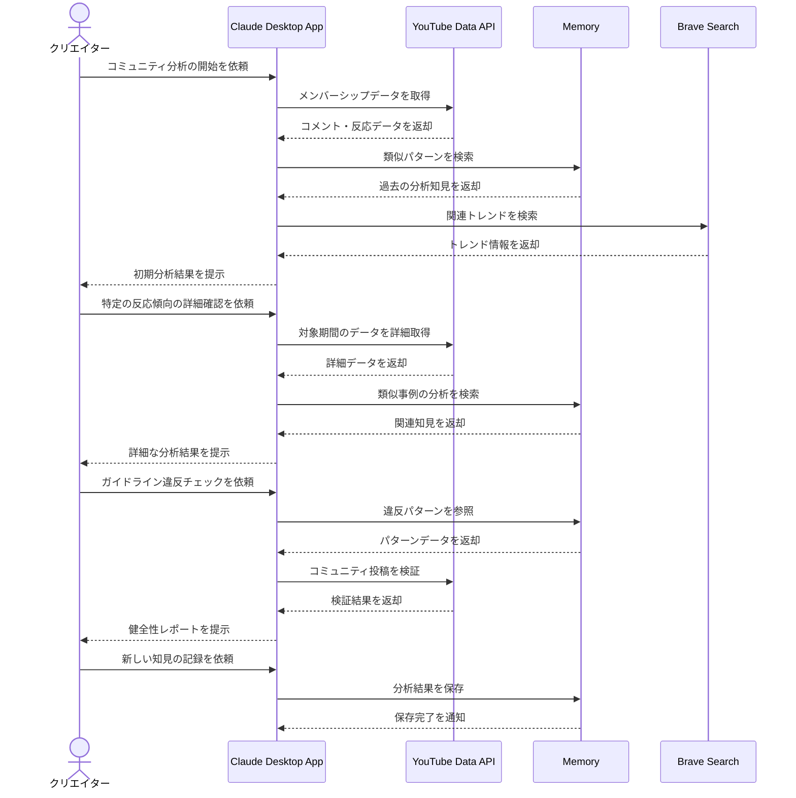

# ファンコミュニティの反応を分析する

## アイデア
YouTubeのメンバーシップコミュニティにおけるファンの反応傾向とコミュニティの健全性を自動分析する。蓄積された知見を活かしながら、リアルタイムなコミュニティマネジメントを支援する。

### 具体例
VTuberのメンバーシップコミュニティで、ライブ配信やメンバー限定動画へのコメント、スーパーチャットなどの反応を分析し、コミュニティの健全性を維持しながら、ファンの興味関心を理解する場面。

## アーキテクチャ
| Type | Name | Role |
|--|--|--|
| Client | Claude Desktop App | 分析支援の対話型アシスタント |
| Server | YouTube Data API | メンバーシップコミュニティのデータ取得（自作Server） |
| Server | Memory | 分析パターンとガイドライン違反の知見蓄積 |
| Server | Brave Search | 関連トレンドの補助的分析 |

## 思考プロセス

### 対象の活動の価値は何か
- ファンの反応とトレンドのリアルタイムな把握
- コミュニティの健全性維持
- データに基づく企画やコンテンツの改善
- プラットフォームをまたいだファン層の理解

### 価値を妨げる課題は何か
- 複数のデータソースからの情報統合
- 不適切なコンテンツの早期発見
- 時系列でのトレンド変化の把握
- メンバーシップ特典の最適化

### なぜ課題が発生するのか、仮説推論
- コミュニティの急速な成長による管理負荷の増大
- プラットフォーム特有の文化やルールの違い
- リアルタイムなモデレーションの必要性
- ファン層の多様化による興味関心の分散