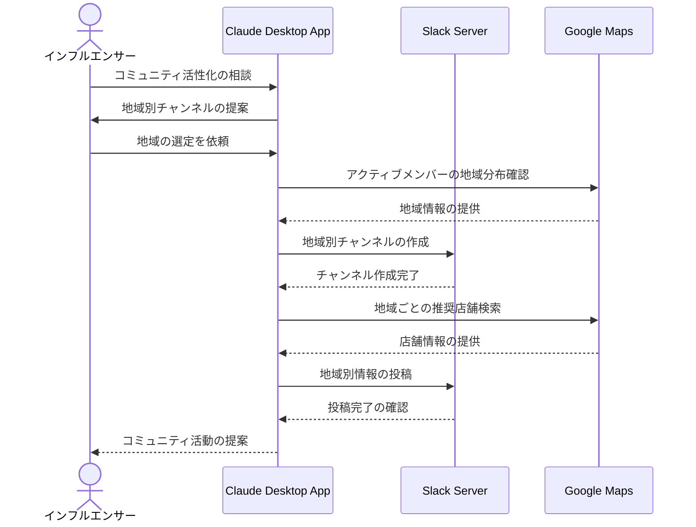

# ファンコミュニティの関係性を深める

## アイデア
Slack ServerとGoogle Maps Serverを組み合わせて、オンラインとオフラインを融合したファンコミュニティを実現する。メンバー同士の交流を促進し、地域ごとのミニコミュニティの形成を支援する。 

### 具体例
美容系インフルエンサーのファンコミュニティで、メンバー同士が美容の悩みを相談し合ったり、地域ごとのオフ会を企画したり、推奨された美容サロンの情報を共有したりする。インフルエンサーはその活動をモデレートしながら、コミュニティの方向性を示す。 

## アーキテクチャ

| Type | Name | Role |
|--|--|--|
| Client | Claude Desktop App | コミュニティ運営のガイド、適切な介入判断の支援 |
| Server | Slack | チャンネル管理、メンバー間のコミュニケーション促進 |
| Server | Google Maps | 地域ごとの推奨店舗情報、オフ会場所の提案 |

## 思考プロセス

### 対象の活動の価値は何か
- ファンとインフルエンサーの深い絆の形成
- メンバー同士の交流によるコミュニティの価値向上
- オンライン・オフラインの相乗効果による関係性の深化 

### 価値を妨げる課題は何か
- 大規模コミュニティでの質の維持が困難
- メンバー一人一人との十分なコミュニケーション不足
- 地域や興味に基づくサブコミュニティの形成機会の不足 

### なぜ課題が発生するのか、仮説推論
- 一人のインフルエンサーでは対応に限界がある
- オンラインのみのコミュニケーションでは関係性に限界がある
- 地域性を活かしたコミュニティ活動の機会が少ない 
