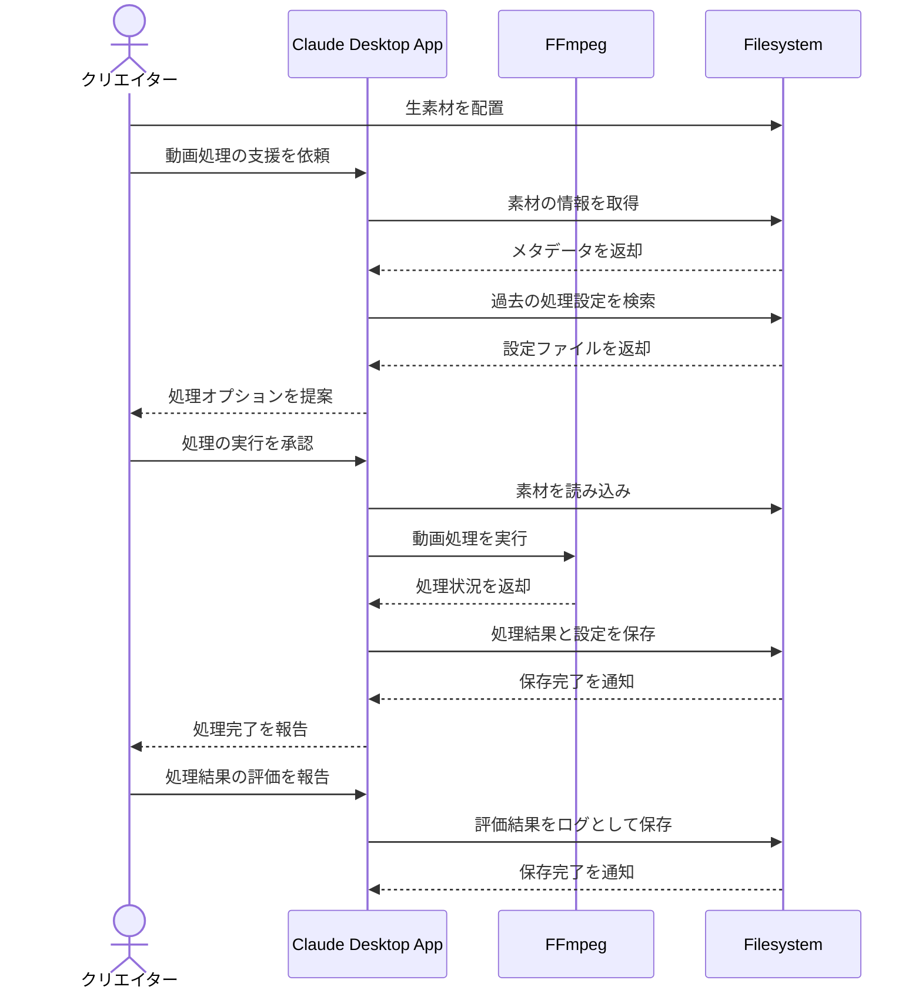

# 動画編集の作業効率を改善する

## アイデア
FFmpegを使用して動画処理の技術的な作業を自動化し、ファイルシステムで素材と設定を管理することで作業を効率化する。クリエイターはクリエイティブな編集作業に集中できる環境を実現する。

### 具体例
週3本の動画を配信するクリエイターが、撮影した生素材の変換、カット編集、エンコードなどの技術的な作業を自動化し、テロップやエフェクトなどのクリエイティブな編集に時間を確保する場面。

## アーキテクチャ
| Type | Name | Role |
|--|--|--|
| Client | Claude Desktop App | 動画処理の対話型アシスタント |
| Server | FFmpeg API | 動画の変換・処理・エンコード（自作Server） |
| Server | Filesystem | 動画素材と処理設定の管理 |

## 思考プロセス

### 対象の活動の価値は何か
- 技術的な動画処理作業の自動化による時間節約
- クリエイティブな編集作業への集中が可能
- 一貫した品質での動画処理の実現
- 素材管理と設定管理の効率化

### 価値を妨げる課題は何か
- 動画フォーマット変換の煩雑さ
- エンコード設定の最適化の難しさ
- 複数動画の並行処理における管理負担
- 処理設定の試行錯誤による時間のロス

### なぜ課題が発生するのか、仮説推論
- 動画フォーマットや編集ソフトの多様化
- プラットフォームごとの最適な設定の違い
- 処理時のリソース管理の複雑さ
- 技術的な知識とクリエイティブスキルの両立の難しさ