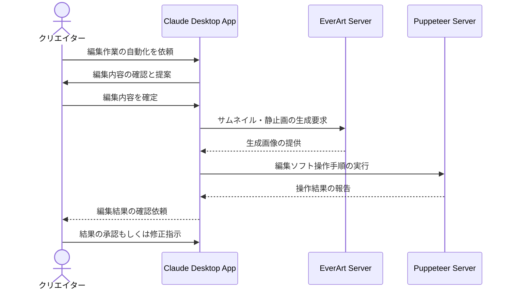

# 動画編集の作業効率を改善する

## アイデア
動画編集の作業効率を向上させるため、EverArtサーバーを活用した自動編集支援と、Puppeteerサーバーを使用した編集ソフトの自動操作を組み合わせる。クリエイターの編集意図を理解し、反復的な作業を自動化する。 

### 具体例
料理動画のクリエイターが、毎回同じようなオープニング、エンディング、テロップ挿入などの編集作業を行う際に、編集ソフトの自動操作により作業を効率化する。また、サムネイル画像の生成や動画内の静止画パートの自動生成にAIを活用する。 

## アーキテクチャ

| Type | Name | Role |
|--|--|--|
| Client | Claude Desktop App | クリエイターとの対話、編集作業の理解と指示 |
| Server | EverArt | サムネイル生成、静止画パートの作成支援 |
| Server | Puppeteer | 編集ソフトの自動操作、UI操作の自動化 |

## 思考プロセス

### 対象の活動の価値は何か
- 高品質な動画コンテンツを効率的に制作できる
- クリエイターの創造的な作業に時間を集中できる
- 一貫性のある編集スタイルを維持できる 

### 価値を妨げる課題は何か
- 反復的な編集作業に時間を取られる
- 複数の編集ツールの操作に習熟が必要
- サムネイルやテロップなどの付随作業の負担 

### なぜ課題が発生するのか、仮説推論
- 動画編集作業の大部分が手作業で行われている
- 編集ソフトの自動化機能が限定的である
- 異なるツール間の連携が不十分である 
