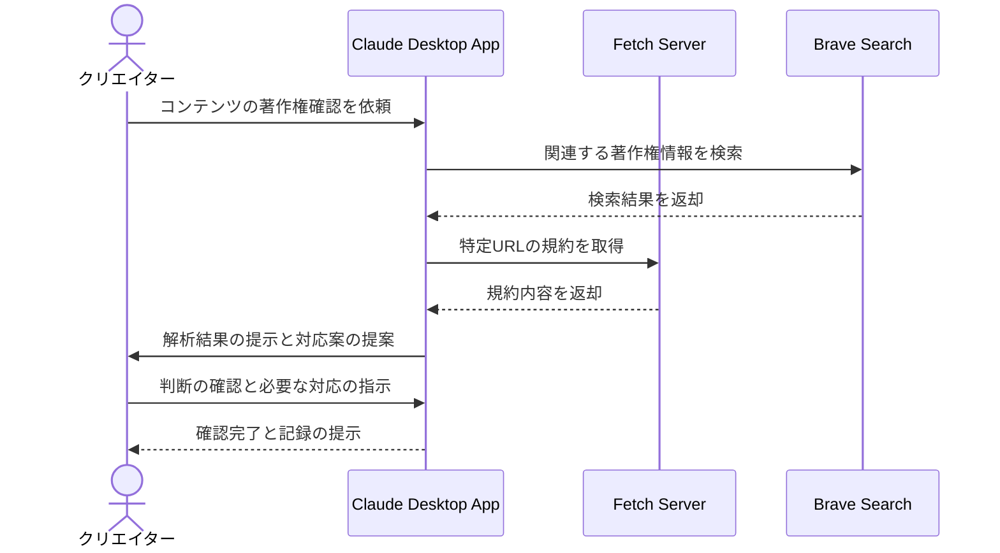

# 著作権情報を効率的に確認する

## アイデア
Fetch・Brave Searchサーバーを組み合わせて、コンテンツの著作権情報を効率的に収集・確認できるシステムを構築する。各種ガイドラインや利用規約の最新情報を自動取得し、コンテンツの安全な公開をサポートする。 

### 具体例
ゲーム実況者が新作ゲームのプレイ動画を公開する際、ゲームパブリッシャーの配信ガイドライン、使用するBGMの著作権情報、効果音の利用規約など、複数の権利関係を効率的に確認する。 

## アーキテクチャ

| Type | Name | Role |
|--|--|--|
| Client | Claude Desktop App | クリエイターとの対話、著作権確認の支援、情報解析と判断支援 |
| Server | Fetch | 各種ガイドラインや利用規約の取得 |
| Server | Brave Search | 最新の著作権情報の検索 |

## 思考プロセス

### 対象の活動の価値は何か
- コンテンツの安全な公開と収益化の実現
- 権利処理の適切な実施によるブランド価値の向上
- 長期的な事業継続の基盤作り 

### 価値を妨げる課題は何か
- 複数の権利者や規約が関係する確認作業の煩雑さ
- 頻繁に更新される規約や条件への追従
- 権利処理の見落としリスク 

### なぜ課題が発生するのか、仮説推論
- 著作権情報が分散して存在し、一元的な確認が困難
- 規約や条件が頻繁に更新される
- 権利確認の自動化ツールが不足している 
