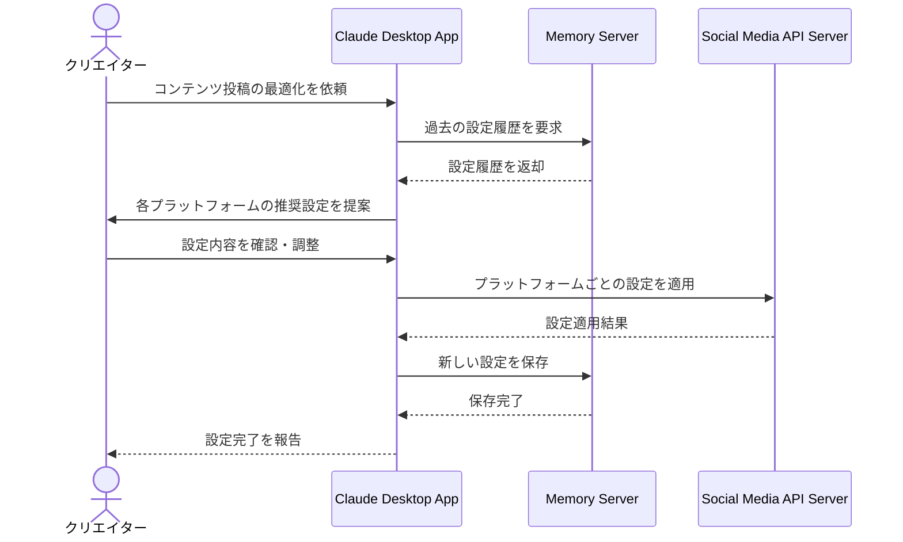

# 複数SNSの投稿設定を最適化する

## アイデア
コンテンツクリエイターがマルチプラットフォームで発信する際の設定作業を自動化・効率化する。統合APIサーバーを活用し、各プラットフォームの最適な投稿設定を一括で行えるようにする。 

### 具体例
料理レシピのクリエイターが、手作りパスタのレシピ動画を複数のSNSプラットフォームに投稿する際、各プラットフォームの特性に応じた最適な設定（動画フォーマット、説明文、ハッシュタグなど）を効率的に行う。 

## アーキテクチャ

| Type | Name | Role |
|--|--|--|
| Client | Claude Desktop App | クリエイターとの対話、投稿設定の最適化支援 |
| Server | Memory | プラットフォームごとの設定履歴や最適化ルールの保存 |
| Server | Social Media API Server（要新規開発） | X API、Instagram API、YouTube Data APIなどを統合し、各SNSプラットフォームとの連携を実現 |

## 思考プロセス

### 対象の活動の価値は何か
コンテンツの最大リーチを実現し、各プラットフォームの特性に最適化された形式で配信することで、より多くのユーザーに効果的にリーチできる 

複数プラットフォームでも統一された質のコンテンツを提供することで、クリエイターのブランド価値が向上する 

### 価値を妨げる課題は何か
プラットフォームごとに異なる仕様（解像度、長さ制限、ファイル形式など）への対応の複雑さ 

各プラットフォーム用の個別編集作業と設定管理の時間的コスト 

### なぜ課題が発生するのか、仮説推論
プラットフォームごとの仕様の違いが大きく、統一的な管理が困難 

仕様の頻繁な更新により、常に最新情報のキャッチアップが必要 

投稿設定やハッシュタグの管理が複雑化し、手動での対応が限界に達している 