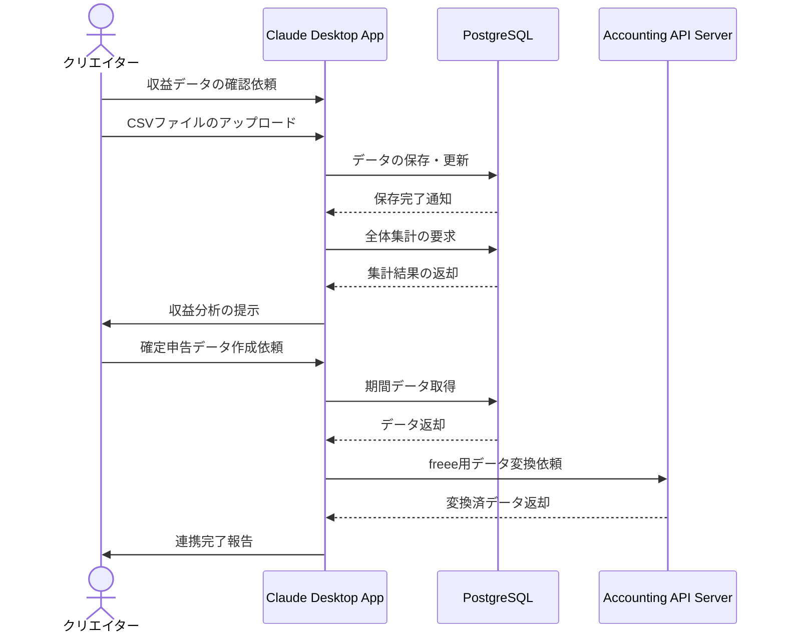

# 複数媒体の収益を一元管理する

## アイデア
PostgreSQLサーバーで収益データを一元管理しつつ、freee API連携用の自作サーバーを活用して、会計処理と確定申告の作業を効率化する。クリエイターが収益管理から確定申告までをシームレスに行えるようにする。 

### 具体例
美容系インフルエンサーが、YouTube収益、アフィリエイト報酬、スポンサー契約、EC売上、イベント収入など、様々な収益源からのデータを管理する。各プラットフォームからダウンロードしたCSVを取り込み、freeeに自動連携することで、確定申告用のデータを正確に作成できる。 

## アーキテクチャ

| Type | Name | Role |
|--|--|--|
| Client | Claude Desktop App | 収益データの分析支援、レポート生成 |
| Server | PostgreSQL | 収益データの保存、集計、分析基盤 |
| Server | Accounting API Server（要新規開発） | freee APIとの連携、会計データの自動変換 |

## 思考プロセス

### 対象の活動の価値は何か
- 複数の収入源による安定した収益基盤の確保
- 適切な帳簿管理によるビジネスの健全性確保
- データに基づく収益構造の分析と改善 

### 価値を妨げる課題は何か
- プラットフォームごとに分散した収益情報
- 形式やタイミングが異なるデータ管理の煩雑さ
- 確定申告のための会計処理の複雑さ 

### なぜ課題が発生するのか、仮説推論
- プラットフォームごとに独自の管理システムがある
- データ形式や集計期間が標準化されていない
- 会計システムとの連携が手動で行われている 
