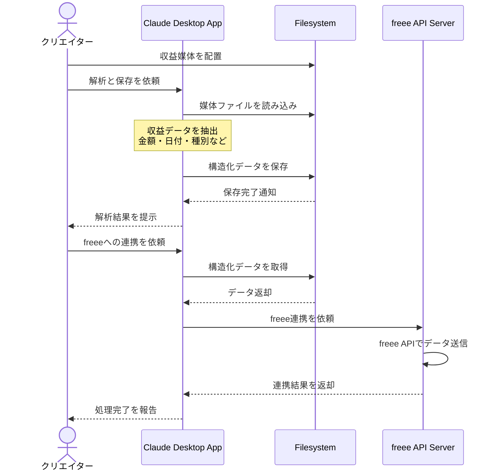

# 複数媒体の収益を一元管理する

## アイデア
各プラットフォームからダウンロードした収益関連の媒体（PDF/画像など）をClaudeが解析し、freee APIと連携することで、収益管理から確定申告までをシームレスに行う。クリエイターは各種プラットフォームの媒体をダウンロードするだけで、会計処理の自動化が実現できる。

### 具体例
美容系インフルエンサーが、YouTube収益、アフィリエイト報酬、スポンサー契約、EC売上、イベント収入など、様々な収益源からのデータをダウンロードし、Claudeに解析させることで収益を一元管理。freeeに自動連携することで、確定申告用のデータを正確に作成できる。

## アーキテクチャ

| Type | Name | Role |
|--|--|--|
| Client | Claude Desktop App（要事前設定） | 媒体からの収益データ抽出、分析支援、レポート生成 |
| Server | Filesystem | 収益媒体と解析結果の保存・管理 |
| Server | freee API Server（要新規開発） | freee APIとの連携、会計データの同期 |

## 思考プロセス

### 対象の活動の価値は何か
- 様々な形式の収益データを一元管理
- 収益情報の自動抽出による作業効率化
- データに基づく収益構造の分析と改善
- 会計処理の自動化による確定申告の効率化

### 価値を妨げる課題は何か
- プラットフォームごとに異なる収益情報の形式
- 収益データ抽出の正確性の確保
- 会計システムとの連携における整合性担保

### なぜ課題が発生するのか、仮説推論
- プラットフォームごとに独自のフォーマットがある
- 媒体形式（PDF/画像）が統一されていない
- 取引の種別や時期の解釈が必要