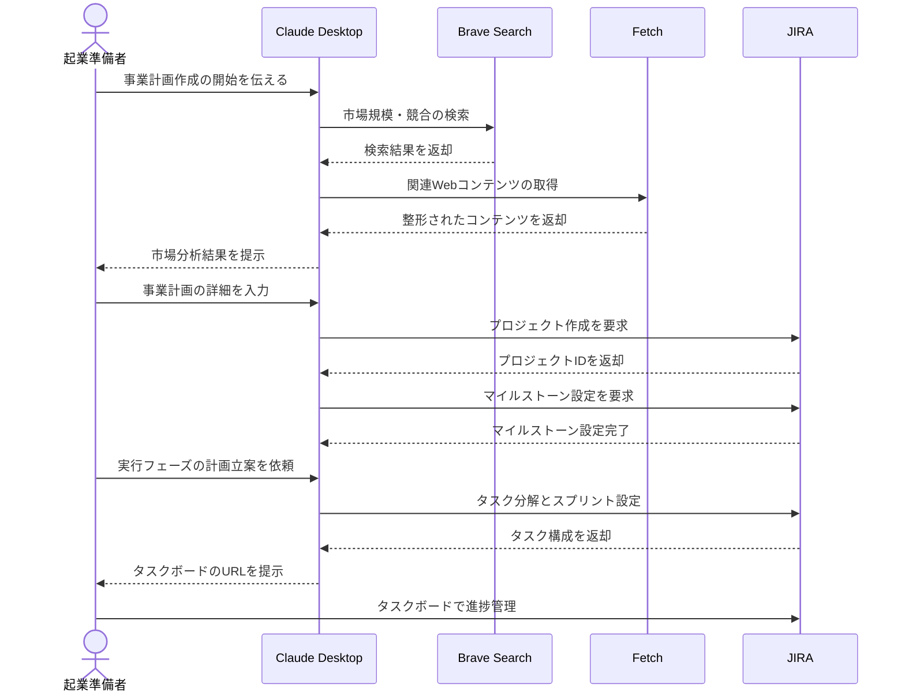

# 事業計画を実践的なタスクに変換する

## アイデア
Brave Search/Fetchによる市場分析とJIRAによるプロジェクト管理を組み合わせ、事業計画を実践的なタスクにまで具体化する支援を行う。市場の最新情報に基づいた計画立案と、その実行管理までをシームレスに連携する。

### 具体例
IT教育サービスの起業を目指す人が、市場分析に基づいて事業計画を作成し、その計画を実際の開発・マーケティング・組織構築などの具体的なタスクとスケジュールに落とし込む場面

## アーキテクチャ

| Type | Name | Role |
|--|--|--|
| Client | Claude Desktop App | ユーザーとの対話、計画立案支援 |
| Server | Brave Search | 市場データと業界動向の収集 |
| Server | Fetch | Webコンテンツの取得と最適化 |
| Server | JIRA | タスク管理とスケジューリング（要自作Server） |

## 思考プロセス

### 対象の活動の価値は何か
- 漠然としていたビジネスアイデアが具体的な計画として形になり、実現可能性を客観的に評価できる 
- 市場の最新動向を踏まえた計画立案が可能になり、より実現性の高い事業計画を作成できる 
- 計画を具体的なタスクに分解し、実行フェーズまでシームレスに管理できる

### 価値を妨げる課題は何か
1. 市場調査や競合分析に必要な情報収集が非効率 
2. 計画と実行が分断され、計画が机上の空論になりやすい 
3. タスクの優先順位付けや工数見積もりが困難

### なぜ課題が発生するのか、仮説推論
1. 情報が分散しており、信頼性の高いデータの取得と分析に労力がかかる 
2. 事業計画書の作成自体が目的化し、実行計画との連携が不足している 
3. 初めての事業立ち上げでは、必要なタスクの全体像を把握することが難しい