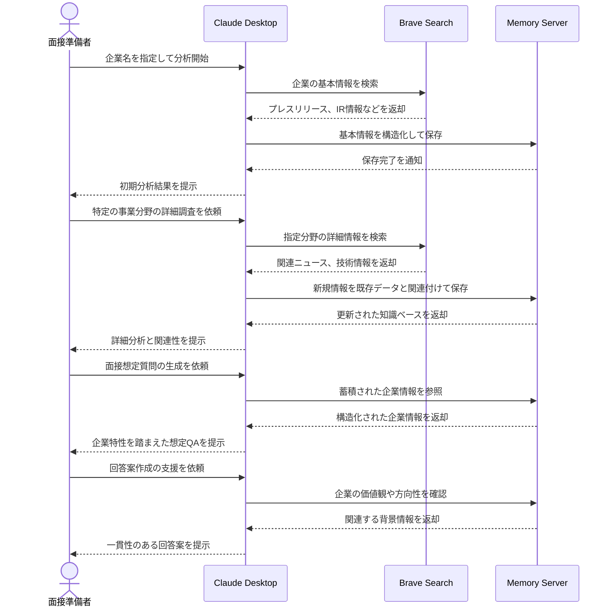

# 企業分析を面接準備に体系化する

## アイデア
Brave SearchとMemoryを組み合わせ、企業研究で得た情報を時系列・トピック別に整理し、その企業への理解を深めながら実践的な面接準備を行う。表層的な情報収集に留まらず、企業の変遷や方向性の理解に基づいた質の高い対策を可能にする。

### 具体例
大手ITサービス企業への転職を考えるエンジニアが、企業の過去の事業展開、現在の注力分野、将来の技術戦略などを多角的に分析し、それらの理解に基づいた面接準備を行う場面

## アーキテクチャ

| Type | Name | Role |
|--|--|--|
| Client | Claude Desktop App | 企業研究と面接準備の支援 |
| Server | Brave Search | 企業に関する包括的な情報収集 |
| Server | Memory | 収集情報の構造化と知識ベース化 |

## 思考プロセス

### 対象の活動の価値は何か
- 企業の歴史、現状、将来の方向性を体系的に理解できる 
- 時系列での変化や事業間の関連性から、企業の本質的な強みを把握できる 
- 表層的な情報を超えた深い理解に基づく、質の高い面接準備が可能になる

### 価値を妨げる課題は何か
1. 大量の企業情報から重要な要素を見極めるのが困難 
2. 時系列での変化や事業間の関連性を把握するのに時間がかかる 
3. 収集した情報を面接対策に効果的に活用する方法が不明確

### なぜ課題が発生するのか、仮説推論
1. 企業情報が様々なソースに分散しており、全体像の把握が難しい 
2. 情報同士の関連性や重要度の判断には、業界知識や経験が必要 
3. 企業理解と面接準備を並行して進めるためのフレームワークが不足している