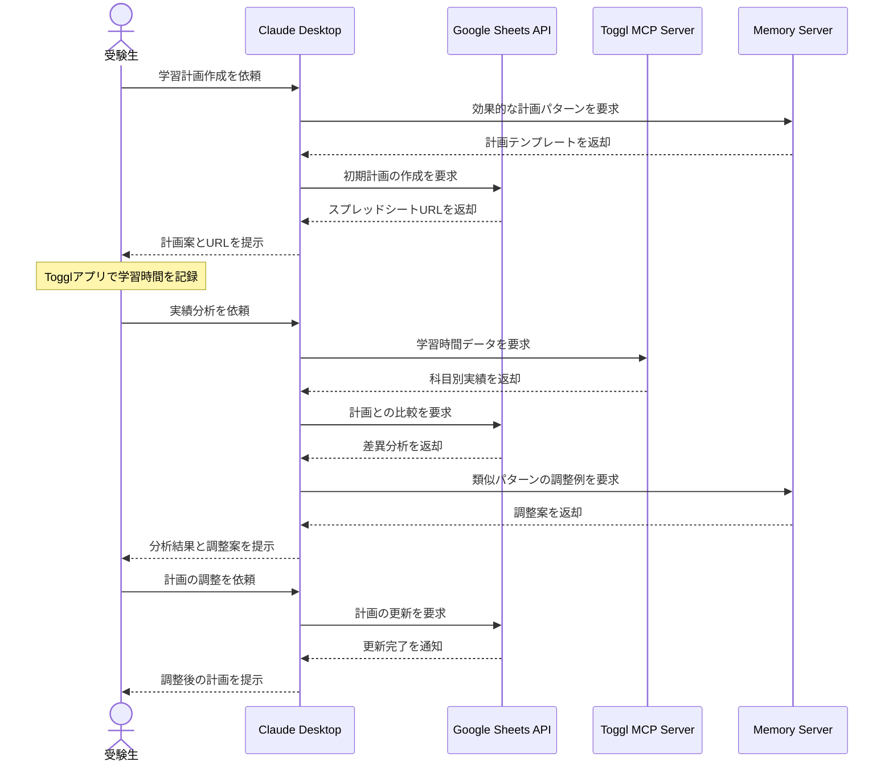

# 学習計画と実績を統合管理する

## アイデア
学習計画の作成と実績の記録を有機的に結びつけ、より効果的な学習管理を実現する。Google Sheetsでの計画管理とTogglでの時間記録を組み合わせることで、計画と実績の差異を分析し、より現実的な計画の作成と調整を支援する。

### 具体例
国立大学志望の高校3年生が、夏休みから入試までの期間で各科目の学習計画を立て、日々の学習時間を記録しながら、定期的に計画を見直し調整する場面

## アーキテクチャ

| Type | Name | Role |
|--|--|--|
| Client | Claude Desktop App | 学習計画の作成と分析の支援 |
| Server | Google Sheets API (要自作) | 学習計画の管理とデータ可視化 |
| Server | Toggl MCP Server (要自作) | Toggl APIを使用した学習時間の集計・分析 |
| Server | Memory | 計画調整パターンの蓄積 |

## 思考プロセス

### 対象の活動の価値は何か
- 計画と実績を一元管理することで、より現実的な学習計画の策定が可能になる 
- 実際の学習パターンや効率を把握し、個人に適した計画に調整できる 
- 時間の使い方の可視化により、学習習慣の改善につながる

### 価値を妨げる課題は何か
1. 日々の学習時間の正確な記録が面倒 
2. 計画と実績の差異分析に時間がかかる 
3. 分析結果を次の計画に効果的に反映するのが難しい

### なぜ課題が発生するのか、仮説推論
1. 学習に集中したい時に記録作業が割り込んでくる 
2. 複数のツールのデータを横断的に分析する手間がかかる 
3. 過去の調整パターンを活かした計画修正の知見が不足している