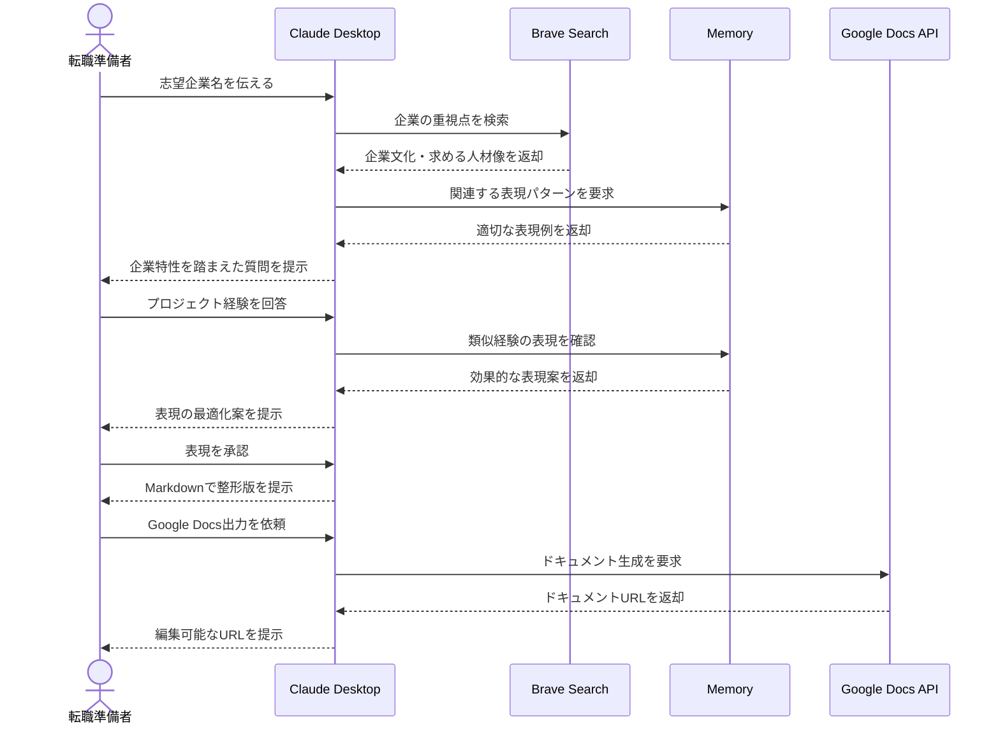

# 職務経歴書を対話的に作成する

## アイデア
志望企業の特徴を踏まえた対話形式で職務経歴を引き出し、Markdownで整形された職務経歴書を作成。必要に応じてGoogle Docs形式での出力も可能にする。企業ニーズと自己PRのマッチングを重視した、効果的な職務経歴書作成を支援する。

### 具体例
事業会社でのプロダクト開発職を目指すエンジニアが、自身のSIer時代のプロジェクト経験を、志望企業が重視する「ユーザー視点」や「改善提案力」といった観点で整理し直す場面

## アーキテクチャ

| Type | Name | Role |
|--|--|--|
| Client | Claude Desktop App | 対話による経歴引き出しと文章化支援 |
| Server | Brave Search | 志望企業の特徴分析 |
| Server | Memory | 効果的な表現パターンの蓄積 |
| Server | Google Docs API (要自作) | 最終形式でのドキュメント作成 |

## 思考プロセス

### 対象の活動の価値は何か
- 志望企業の特徴を踏まえた効果的な経歴の表現が可能になる 
- 対話形式で自然に経験や成果を引き出すことができる 
- 企業秘密に配慮しつつ、成果を適切に表現できる

### 価値を妨げる課題は何か
1. 過去の経験を適切な粒度で思い出すことが困難 
2. 志望企業にアピールする表現への変換が難しい 
3. 一般的なテンプレートでは独自性が出しにくい

### なぜ課題が発生するのか、仮説推論
1. 日々の業務を振り返る機会が少なく、具体的な成果の記録が不足している 
2. 企業が求める要素と自身の経験を結びつける視点が不足している 
3. 形式的な職務経歴書作成に終始し、自己表現の機会を活かしきれていない