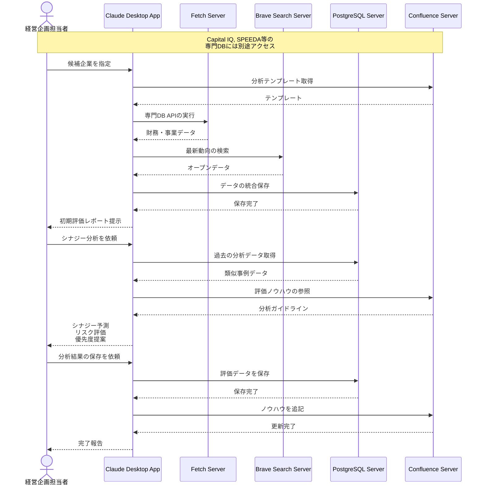

# M&A候補企業の分析を効率化する

## アイデア
M&A専門データベースの分析結果を起点に、ニュースやソーシャルメディアなどの最新情報を組み合わせて、より包括的な企業評価を支援します。専門家の深い分析と、オープンデータでのトレンド把握を組み合わせることで、シナジー効果の予測とリスク評価の質を向上させます。 

### 具体例
製造業の経営企画部門が新規事業領域への参入を検討する際、Capital IQやSPEEDAでの定量分析を基に、最新の市場動向や企業評判をオープンデータから収集。財務・事業性評価に加えて、組織カルチャーや市場での評価も含めた、より立体的な企業理解を実現します。 

## アーキテクチャ
| Type | Name | Role |
|--|--|--|
| Client | Claude Desktop App | データ統合と分析支援のインターフェース |
| Server | Brave Search | ニュース、SNS、業界トレンドの収集 |
| Server | PostgreSQL | 分析データの集約と履歴管理 |
| Server | Fetch | 専門DBからのデータ取得 |
| Server | Confluence | 分析テンプレートと評価ノウハウの管理 |

## 思考プロセス

### 対象の活動の価値は何か
- 専門家による定量分析と最新のオープンデータの組み合わせ
- 財務・事業面だけでなく、組織や市場評価も含めた多角的な分析
- 過去の分析事例とノウハウの組織的な蓄積と活用
- より質の高い意思決定のための情報提供

### 価値を妨げる課題は何か
- 専門DBとオープンデータの統合的な分析の難しさ
- データソースごとの更新タイミングのばらつき
- 定性的な評価要素の数値化や比較の困難さ
- 分析ノウハウの属人化

### なぜ課題が発生するのか、仮説推論
- 各種専門DBが独立して存在し、横断的な分析が困難
- オープンデータの信頼性や重要度の判断が必要
- 業界特性や企業規模による評価基準の違い
- 分析経験の共有と再利用の仕組みが不足