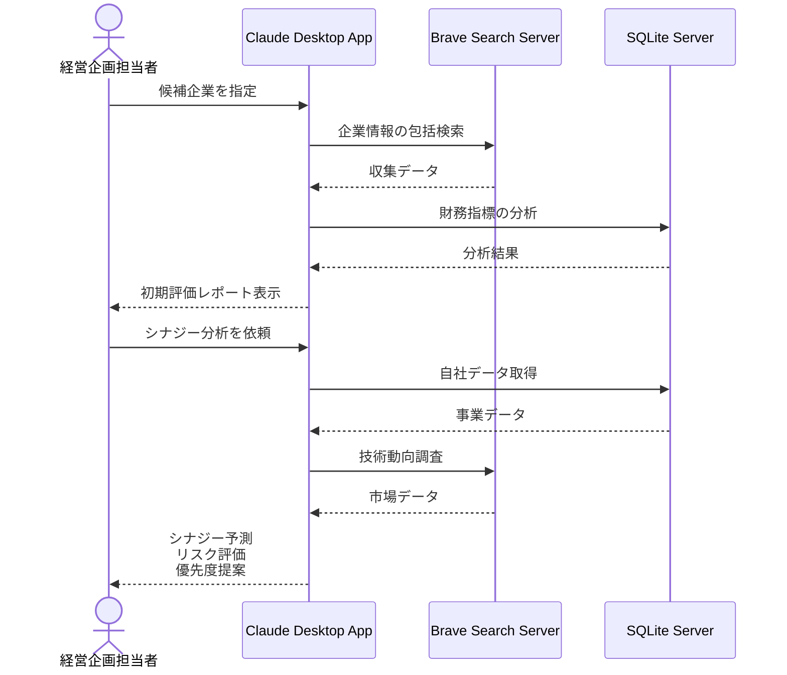

# M&A候補企業の分析を効率化する

## アイデア
M&A候補企業の分析プロセスを効率化するため、企業の公開情報やニュース、特許情報などを自動収集し、多角的な企業価値評価を支援します。シナジー効果の予測と潜在的なリスクの早期発見により、意思決定の質を向上させます。 

### 具体例
製造業の経営企画部門が新規事業領域への参入を検討する際、候補企業の財務データ、技術資産、市場での評価を包括的に分析。企業の成長性や技術的優位性を可視化し、買収後のシナジー効果をシミュレーション。デューデリジェンスの優先順位付けや交渉戦略の立案に活用できます。 

## アーキテクチャ
| Type | Name | Role |
|--|--|--|
| Client | Claude Desktop App | データ分析、評価レポート生成のインターフェース |
| Server | Brave Search | 企業情報、ニュース、特許情報の収集 |
| Server | SQLite | 財務データと評価指標の管理・分析 |

