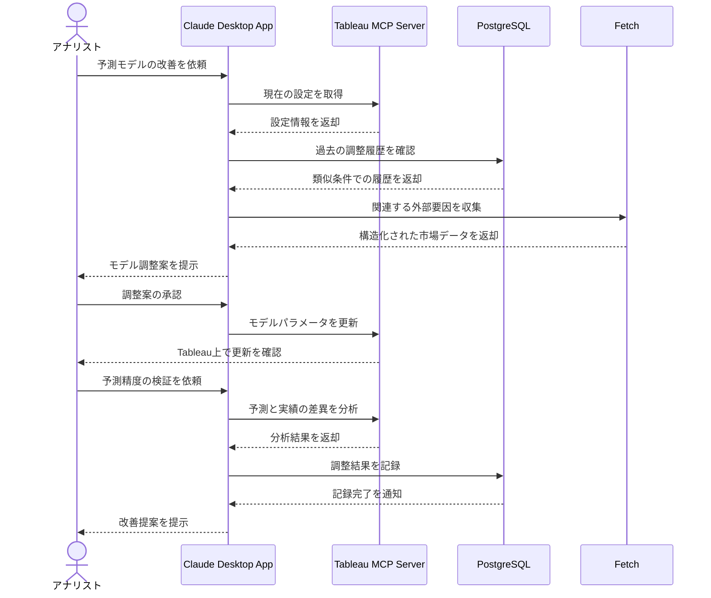

# TableauでKPIダッシュボードを改善する

## アイデア
Tableauを活用した業績予測において、予測モデルのパラメータ調整とデータソース連携を効率化。外部要因の取り込みを自動化し、予測精度を向上させる。

### 具体例
小売チェーンの経営企画部で、店舗別の売上予測モデルのパラメータを調整する場面。新規出店の影響や外部要因を加味しながら、Tableauダッシュボードの予測精度を向上させる。

## アーキテクチャ
| Type | Name | Role |
|--|--|--|
| Client | Claude Desktop App | 予測モデル改善の対話型支援 |
| Server | Tableau MCP Server [要自作] | TableauのREST APIを利用した設定値の取得・更新 |
| Server | PostgreSQL | モデル調整履歴とその効果の記録 |
| Server | Fetch | 外部要因データの構造化収集 |

## 思考プロセス

### 対象の活動の価値は何か
- 予測モデルの継続的な精度向上と工数削減
    - モデル調整の試行錯誤を効率化
    - 新規出店影響の定量化が容易に
    - レポート作成の自動化

### 価値を妨げる課題は何か
- Tableau操作の専門性が必要
- モデル調整の判断基準が属人化
- 外部要因の取り込みが手作業

### なぜ課題が発生するのか、仮説推論
- Tableauの機能が多岐にわたり習熟に時間が必要
- 予測精度向上のノウハウが体系化されていない
- 各種データソースとの連携に個別の設定が必要